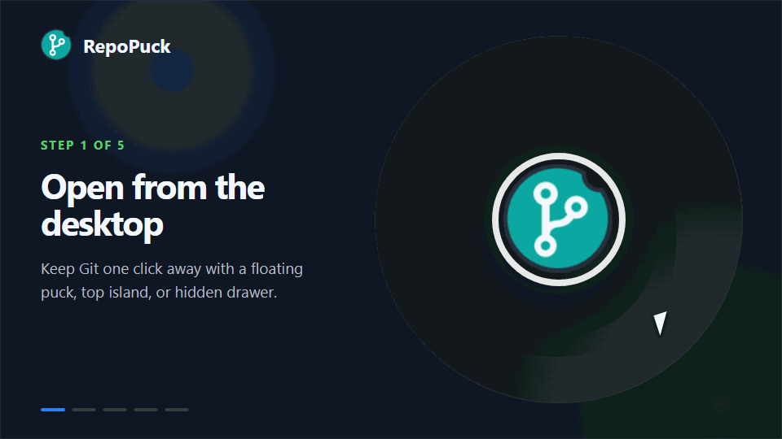

<div align="center">
  

  <h1>RepoPuck</h1>

  <p><strong>Stage, commit, and push without leaving your flow.</strong></p>
  <p>An always-ready Windows Git companion with no GitHub sign-in required.</p>

  <p>
    <a href="README.md">简体中文</a>
    ·
    <strong>English</strong>
  </p>

  <p>
    <a href="https://github.com/YYchainsAw/RepoPuck/releases/latest"></a>
    <a href="https://github.com/YYchainsAw/RepoPuck/releases"></a>
    <a href="https://github.com/YYchainsAw/RepoPuck/actions/workflows/ci.yml"></a>
    <a href="LICENSE"></a>
    
  </p>

  <p>
    <a href="https://github.com/YYchainsAw/RepoPuck/releases/latest"><strong>⬇️ Download the latest release</strong></a>
    ·
    <a href="#-quick-start">Quick start</a>
    ·
    <a href="https://github.com/YYchainsAw/RepoPuck/discussions">Discussions</a>
    ·
    <a href="#-contributing">Contributing</a>
  </p>
</div>

<br>

RepoPuck keeps everyday Git actions in a small panel that is always close by. Select files, switch branches, commit, and push without leaving your current workflow for a small change.

<p align="center">
  
</p>

<p align="center">
  <strong>No GitHub sign-in</strong>
  ·
  <strong>AI stays optional</strong>
  ·
  <strong>Open source for Windows</strong>
</p>

## ✨ Why RepoPuck?

- ⚡ **A shorter commit path** — select files, write a message, then choose **Commit** or **Commit & Push**.
- 🤖 **AI commit-message drafts** — use your own OpenAI-compatible API to turn staged changes into Chinese or English Conventional Commits.
- 🧩 **Three desktop surfaces** — use a floating puck, an attached top island, or an auto-revealing top drawer.
- 🪶 **Lightweight and focused** — common actions stay visible while secondary actions live in the More menu.
- ⚡ **Low-overhead refreshes** — when the repository is unchanged, RepoPuck checks a lightweight state fingerprint instead of rebuilding the full snapshot.
- 🌗 **A familiar GitHub-style interface** — powered by GitHub Primer with light, dark, and system themes.
- 🌐 **简体中文 and English** — follow the system language by default or switch manually in Settings.
- 🔐 **No GitHub account lock-in** — reuse system Git, Git Credential Manager, or SSH.
- 🖥️ **Native Windows behavior** — system tray, always-on-top launchers, hidden console processes, DPI and multi-monitor support, and restored geometry.

The interface follows the Windows language by default. Choose **System, 中文, or English** from **More → Settings → Interface language** to update the panel, puck or island, tray menu, and native confirmation dialogs together without restarting.

## 🧭 Three desktop entry points

Choose an entry point from **More → Settings → Launch mode**. Every entry point uses the same Git workspace, so changing the surface does not change the selected repository, staged files, or commit draft.

| Mode | Behavior | Best for |
| --- | --- | --- |
| 🟢 **Floating puck** | Drag it anywhere on the desktop. Click once to open the panel and again to close it; the panel chooses a suitable puck corner. | A Git entry point that remains visible |
| 🏝️ **Top island** | Blends into the top of the display work area and drops the panel directly underneath. | A fixed, predictable top launcher |
| 📜 **Top drawer** | Hides in a top-edge hot zone, reveals when the pointer approaches, and can move horizontally while remembering its position. | A workspace that occupies no desktop space while hidden |

| Floating puck panel | Top island | Movable top drawer |
| --- | --- | --- |
|  |  |  |

The panel is resizable and remembers a separate size for each mode. The drawer uses a native cursor hot zone instead of a transparent WebView covering the desktop, so it does not block clicks near the top edge while hidden.

## ✅ Git workflow

- 📂 Select a local repository or reopen one from the recent list.
- 👀 Review **Changes** and **Unversioned files** separately.
- ☑️ Stage or unstage individual files and complete groups.
- 🌿 Switch local branches or create a new branch.
- 💬 Write a commit message yourself or generate a draft from staged changes, with a focused 72-character limit.
- ✅ Commit locally without pushing.
- 🚀 Use the separate **Commit & Push** action or push later.
- ✏️ Amend the most recent local commit after confirmation, without an automatic force-push.
- 🔄 Fetch, pull, push, stash, and refresh; long-running Fetch operations show elapsed time and can be cancelled safely.
- 🗂️ Open the repository in Explorer or a terminal.

Keyboard shortcuts:

- `Enter` — Commit
- `Ctrl + Enter` — Commit & Push
- `Win + B` — reach the RepoPuck tray menu through the Windows notification area, including when the top drawer is hidden

RepoPuck intentionally leaves merge, rebase, cherry-pick, destructive reset, conflict editing, remote management, and force-push to your IDE or terminal. Keeping high-risk and low-frequency operations outside the panel makes the common path lighter and safer.

## 🤖 AI-generated commit messages

AI assistance is optional and never replaces the manual commit flow:

1. Open **More → Settings → AI commit message**.
2. Enter an OpenAI-compatible Base URL, model name, and API key.
3. Choose Chinese or English for the generated message.
4. Stage files and select the compact **AI** button beside the commit field. The model infers a type such as `feat`, `fix`, or `docs` and an optional scope from the staged diff. RepoPuck fills the draft but never commits or pushes automatically.

RepoPuck validates the complete Conventional Commit returned by the model and normalizes it to a single line such as `feat: subject` or `feat(ui): subject`, with a 72-character limit. You can edit every generated draft before committing.

> [!IMPORTANT]
> API keys are stored separately for each provider origin in **Windows Credential Manager** for the current user. They are never written to `settings.json`, browser storage, logs, or the repository. After switching provider hosts, you must explicitly confirm an existing legacy key or save a key for that provider; RepoPuck never silently sends an old key to a new origin. Only when you explicitly generate a message does RepoPuck send a size-bounded **staged text diff** directly to the configured service. Settings previews the included file count, approximate bytes, omitted binaries, excluded sensitive paths, and truncation state. Automatic filtering cannot identify every secret, so review the staged content and your provider's privacy policy before using any third-party service.

## 🚀 Quick start

### Install

1. Open [GitHub Releases](https://github.com/YYchainsAw/RepoPuck/releases/latest).
2. Choose the standard MSI installer, or extract `windows-x64-portable.zip` and run it directly.
3. Launch the installed build from the Start menu; either build remains available in the system tray.
4. Choose a local Git repository.
5. Select files, enter a commit message, then choose **Commit** or **Commit & Push**.

> [!WARNING]
> Current installers are not code-signed. Windows may show **Unknown publisher** or a Microsoft Defender SmartScreen warning. Download only from this repository's GitHub Releases, then verify `SHA256SUMS.txt` and the GitHub build provenance attached to the release.

### Requirements

- Windows 10 or Windows 11
- [Git for Windows](https://gitforwindows.org/) installed and available on `PATH`
- Microsoft Edge WebView2 Runtime, normally included with supported Windows versions
- Existing Git Credential Manager credentials or a configured SSH agent/key for remote operations

RepoPuck does not host an interactive terminal sign-in flow. Confirm that `git fetch` or `git push` works in the repository terminal before using remote actions.

## 🧩 Optional project-aware enhancements

RepoPuck keeps the ordinary repository experience focused on common Git actions. Semantic file groups and additional read-only safety guidance appear only after a supported project structure is positively detected; these features never modify, stage, or block your files.

## 🔗 Optional: open with the editor

RepoPuck works completely without an editor bridge. Install one only if you want RepoPuck to start automatically and select the current project when the editor opens.

| Editor | Installation | Behavior |
| --- | --- | --- |
| 🟦 **Unity 2021.3+** | In Unity Package Manager choose **Add package from disk** and select [`integrations/unity/com.repopuck.editor/package.json`](integrations/unity/com.repopuck.editor/package.json). | Sends one wake request per editor session and skips Batch Mode. |
| 🟪 **Unreal Editor / Win64** | Copy [`integrations/unreal/RepoPuckEditor`](integrations/unreal/RepoPuckEditor) to `<YourProject>/Plugins/RepoPuckEditor`, enable it, and restart the editor. | Wakes RepoPuck after engine initialization, skips commandlets and unattended sessions, and supports Blueprint-only projects. |

The bridges only ask RepoPuck to open a project. They do not run Git inside the editor, read credentials, or modify project assets. The bridges are currently Beta features; see the [Unity guide](integrations/unity/README.md) and [Unreal guide](integrations/unreal/README.md) for installation and removal details.

RepoPuck also accepts explicit command-line activation:

```powershell
.\repopuck.exe open "D:\Games\OrbitTactics"
.\repopuck.exe --repo "D:\Games\OrbitTactics"
```

Installed builds register the local `repopuck://open?path=...` scheme. The first protocol request for an unknown project shows the exact path and asks for confirmation. The protocol cannot perform a Git mutation or change settings.

## 🔐 Authentication, privacy, and safety

### No GitHub sign-in

RepoPuck does not ask you to sign in to GitHub and does not store GitHub tokens, passwords, SSH private keys, or Git credentials. Remote actions are delegated to system Git:

- HTTPS uses the existing Git Credential Manager.
- SSH uses the existing agent and keys.
- The same model works with GitLab, self-hosted servers, and other standard Git remotes.

### Local data

RepoPuck persists only non-secret convenience settings: theme, pin state, shell mode, panel size, launcher position, selected display, drawer position, a bounded list of recent repository paths, and AI endpoint, model, and language. It does not store commit contents, repository file contents, or cursor history; the optional AI API key is stored separately in Windows Credential Manager.

### Git processes

The Rust core launches `git` directly with an argument array rather than interpolating repository data into a shell command. On Windows, Git processes run without a visible console, use bounded output and time limits, and belong to a Job Object so a timeout ends the complete process tree. User-facing errors are kept conservative to avoid exposing credential-bearing remote URLs or process environment data.

## 🛠️ Technology stack

| Layer | Technology | Role |
| --- | --- | --- |
| Desktop shell | **Tauri 2 + WebView2** | Native windows, tray, IPC, deep links, and MSI packaging |
| Native core | **Rust 2021** | Git orchestration, project analysis, validation, window geometry, and process safety |
| Interface | **React 19.2 + TypeScript 5.8** | Git workspace, launchers, settings, state, and typed boundaries |
| Design system | **GitHub Primer + Octicons** | Controls, icons, themes, and GitHub-style visual language |
| Build tooling | **Vite 6.4 + pnpm 10** | Development, locked dependencies, and production builds |
| Testing | **Vitest 3 + Testing Library + Rust tests** | UI, Git services, window state machines, geometry, and accessibility |
| Git engine | **System Git CLI** | Repository status and local/remote operations |
| AI interface | **OpenAI-compatible Chat Completions** | User-supplied service for staged-diff commit drafts |
| Automation | **GitHub Actions** | Frontend checks, Rust checks, and Windows MSI builds |

The application reuses one lightweight launcher WebView and one shared Git panel WebView. React calls typed Tauri commands; repository validation, Git operations, game-project analysis, and shell state stay inside the Rust boundary.

Read the [architecture guide](docs/architecture.md) and [v0.2.0 design QA record](docs/design-qa.md) for implementation and validation details.

## 👩‍💻 Development

### Prerequisites

- Node.js 22
- pnpm 10.18.3
- Rust 1.97.1 with the MSVC toolchain
- Microsoft C++ Build Tools with **Desktop development with C++** and a Windows SDK
- Git for Windows
- WebView2 Runtime
- The Windows **VBSCRIPT** optional feature when packaging an MSI

### Clone and run

```powershell
git clone https://github.com/YYchainsAw/RepoPuck.git
Set-Location RepoPuck
git checkout develop
pnpm install --frozen-lockfile
pnpm tauri dev
```

For UI work with deterministic demo data and no real repository writes:

```powershell
pnpm dev
```

### Quality gates

```powershell
pnpm lint
pnpm typecheck
pnpm test
pnpm build

Push-Location src-tauri
cargo fmt --check
cargo clippy --locked --all-targets -- -D warnings
cargo test --locked
Pop-Location
```

Build a Windows MSI:

```powershell
pnpm tauri build --bundles msi
```

## 🗺️ Roadmap

- [x] 🟢 Floating puck with four-corner attachment
- [x] 🏝️ Top island attached to the display edge
- [x] 📜 Movable, auto-revealing top drawer
- [x] 📐 Resizable panel with per-mode saved geometry
- [x] 🌗 Light, dark, and system themes
- [x] 🌍 Simplified Chinese / English interface with system and manual selection
- [x] ✅ Common Git commit, push, sync, and branch workflows
- [x] 🎮 Unity / Unreal detection and semantic file groups
- [x] 🛡️ `.meta`, generated-file, large-file, and Git LFS guidance
- [x] 🔗 Single-instance CLI, deep links, and optional editor bridge source
- [x] 🤖 Optional Chinese and English AI Conventional Commit drafts
- [x] ⚡ State-fingerprint refreshes, non-blocking remote operations, and cancellable Fetch
- [x] 🔐 Provider-isolated AI credentials and outbound-context summaries
- [x] 📦 Silent Windows MSI install/uninstall smoke tests
- [ ] 🎮 Validate the bridges in more real Unity and Unreal editor versions
- [ ] 🔏 Windows code signing
- [ ] ⌨️ Configurable global keyboard shortcut
- [ ] 🔔 Optional push and fetch notifications

The roadmap follows real workflow feedback. Focused ideas and bug reports are welcome in [GitHub Issues](https://github.com/YYchainsAw/RepoPuck/issues).

## ❓ FAQ

<details>
<summary><strong>Do I need to sign in to GitHub?</strong></summary>

No. RepoPuck reuses system Git authentication over HTTPS or SSH and also works with GitLab, self-hosted Git services, and other standard remotes.
</details>

<details>
<summary><strong>Do Unity or Unreal projects require a plugin?</strong></summary>

No. Select the project manually to get detection, semantic groups, and safety guidance. The bridges only wake RepoPuck automatically when an editor starts.
</details>

<details>
<summary><strong>Why is there no merge, rebase, or conflict editor?</strong></summary>

RepoPuck focuses on the frequent, low-friction commit path. Leaving complex history operations to an IDE or terminal keeps the desktop panel small and reduces accidental risk.
</details>

<details>
<summary><strong>Why does Windows show Unknown publisher?</strong></summary>

The installer does not yet carry a Windows code-signing certificate. Download only from this repository's Releases and verify the SHA-256 in the release notes.
</details>

## 🤝 Contributing

Read [CONTRIBUTING.md](CONTRIBUTING.md) before starting. For usage help, begin with [SUPPORT.md](SUPPORT.md). Development is based on `develop`; prefer small, coherent commits and run the complete quality gates before opening a pull request.

Changes to native windows, the tray, Git processes, or packaging also need a Windows-native smoke test. Visible interface changes should include light/dark captures and a check at the minimum panel size.

If RepoPuck makes your workflow better:

- ⭐ Star the repository so more Windows developers can find it.
- 🐛 Use the [Bug form](https://github.com/YYchainsAw/RepoPuck/issues/new?template=bug_report.yml) for a reproducible problem.
- 💡 Use [Workflow feedback](https://github.com/YYchainsAw/RepoPuck/issues/new?template=workflow_feedback.yml) to share real Git friction.
- 💬 Join [Discussions](https://github.com/YYchainsAw/RepoPuck/discussions) for installation help, usage questions, and ideas.
- 🧑‍💻 Fix a focused problem or submit a pull request.

## 🙏 Acknowledgements

RepoPuck's interface language is built on [GitHub Primer](https://primer.style/) and [Octicons](https://primer.style/octicons/). Desktop capabilities come from [Tauri](https://tauri.app/) and the Rust ecosystem. Thank you to everyone who tests, reports issues, and contributes.

## 📄 License

RepoPuck is open source under the [MIT License](LICENSE). You may use, copy, modify, merge, publish, and distribute the project under the terms of that license.

Copyright © 2026 YYchainsAw.

---

<div align="center">
  <strong>Git, one click away. Stay in flow.</strong><br>
  If RepoPuck helps you, consider leaving a ⭐ Star.
</div>
