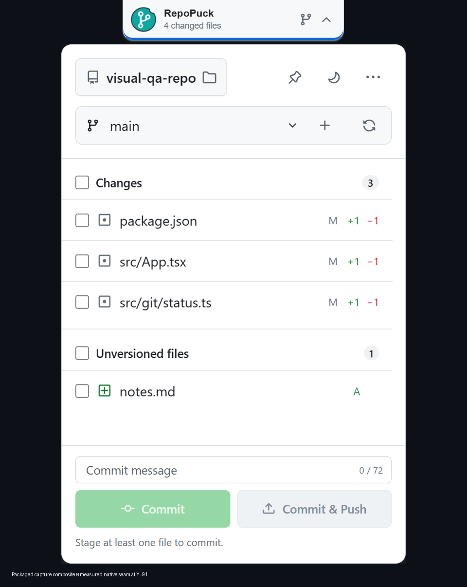
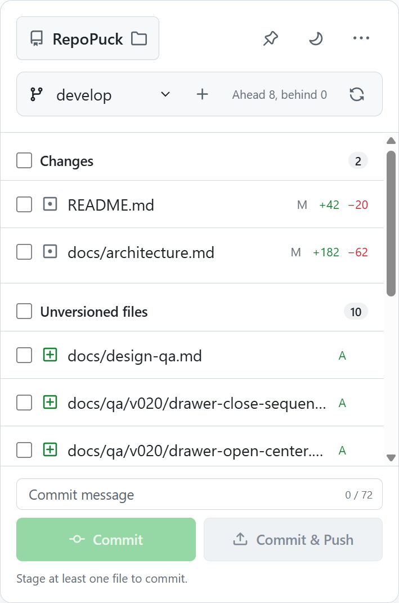
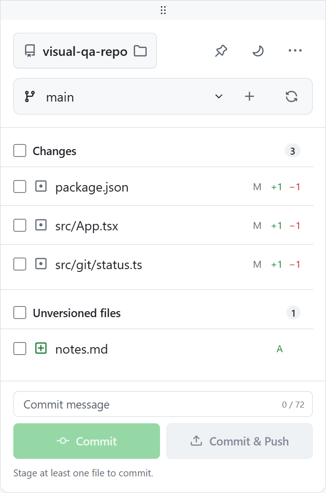

<div align="center">
  

  <h1>RepoPuck</h1>

  <p><strong>Small on screen. Fast in flow.</strong></p>
  <p>A lightweight desktop Git companion for Windows, built for Unity, Unreal Engine, and Visual Studio workflows.</p>

  <p>
    <a href="README.md">简体中文</a>
    ·
    <strong>English</strong>
  </p>

  <p>
    <a href="https://github.com/YYchainsAw/RepoPuck/releases/latest"></a>
    <a href="https://github.com/YYchainsAw/RepoPuck/releases"></a>
    <a href="https://github.com/YYchainsAw/RepoPuck/actions/workflows/ci.yml"></a>
    
  </p>

  <p>
    <a href="https://github.com/YYchainsAw/RepoPuck/releases/latest"><strong>⬇️ Download the latest release</strong></a>
    ·
    <a href="#-quick-start">Quick start</a>
    ·
    <a href="#-contributing">Contributing</a>
  </p>
</div>

<br>

RepoPuck keeps the Git actions you use every day in a small panel that is always close by. Select files, switch branches, commit, and push without repeatedly leaving Unity, Unreal Editor, Visual Studio, or your current workspace—and without opening a full Git client for a tiny commit.

> [!IMPORTANT]
> **RepoPuck does not require a Unity package or Unreal plugin.** Select a project manually and game-project detection, semantic file groups, and safety checks work immediately. The included editor bridges are optional and only wake RepoPuck when an editor opens.

<p align="center">
  
</p>

## ✨ Why RepoPuck?

- ⚡ **A shorter commit path** — select files, write a message, then choose **Commit** or **Commit & Push**.
- 🎮 **Built for game development** — recognize Unity and Unreal projects and separate code, scenes, Blueprints, assets, configuration, and generated files.
- 🧩 **Three desktop surfaces** — use a floating puck, an attached top island, or an auto-revealing top drawer.
- 🪶 **Lightweight and focused** — common actions stay visible while secondary actions live in the More menu.
- 🌗 **A familiar GitHub-style interface** — powered by GitHub Primer with light, dark, and system themes.
- 🔐 **No GitHub account lock-in** — reuse system Git, Git Credential Manager, or SSH.
- 🖥️ **Native Windows behavior** — system tray, always-on-top launchers, hidden console processes, DPI and multi-monitor support, and restored geometry.

## 🧭 Three desktop modes

Choose a mode from **More → Settings → Launch mode**. Every mode uses the same Git workspace, so changing the surface does not change the selected repository, staged files, or commit draft.

| Mode | Behavior | Best for |
| --- | --- | --- |
| 🟢 **Floating puck** | Drag it anywhere on the desktop. Click once to open the panel and again to close it; the panel chooses a suitable puck corner. | A Git entry point that remains visible |
| 🏝️ **Top island** | Blends into the top of the display work area and drops the panel directly underneath. | A fixed, predictable top launcher |
| 📜 **Top drawer** | Hides in a top-edge hot zone, reveals when the pointer approaches, and can move horizontally while remembering its position. | A workspace that occupies no desktop space while hidden |

| Floating puck panel | Top island | Movable top drawer |
| --- | --- | --- |
|  |  |  |

The panel is resizable and remembers a separate size for each mode. The drawer uses a native cursor hot zone instead of a transparent WebView covering the desktop, so it does not block clicks near the top edge while hidden.

## 🎮 Made for Unity, Unreal, and Visual Studio

RepoPuck stays simple for ordinary Git repositories and adds read-only analysis when it detects a game project.

### Project detection

- **Unity** — recognizes root-level `Assets` and `ProjectSettings` directories and reads `ProjectSettings/ProjectVersion.txt` when available.
- **Unreal Engine** — recognizes a `.uproject` plus at least one of `Content`, `Config`, `Source`, or `Plugins`, and reads `EngineAssociation` when available.
- **Nested projects** — a Unity or Unreal project may live below a larger Git root. RepoPuck runs Git from the repository root while remembering the game-project directory the user selected.
- **Visual Studio** — no extension is required; select its Git repository to use the complete generic RepoPuck workflow.

Detected game projects organize tracked or staged paths by purpose:

| Group | Typical contents |
| --- | --- |
| 💻 **Code** | C++, C#, scripts, shaders, and related source |
| 🎬 **Scenes & Blueprints** | Unity scenes, prefabs, and playables; Unreal maps and Blueprint assets |
| 🎨 **Assets** | Models, textures, audio, video, fonts, and engine assets |
| ⚙️ **Configuration** | ProjectSettings, Packages, Config, `.uproject`, `.uplugin`, `.meta`, and related files |
| 🧹 **Generated files** | Unity Library/Temp/Logs and Unreal Binaries/Intermediate/Saved output |
| 📄 **Other changes** | Paths that do not match a known convention |

Untracked paths remain in a separate **Unversioned files** group so newly generated content is not silently mixed into a commit.

### Pre-commit safety guidance

RepoPuck explains common risks in the current change set:

- 🧩 A Unity asset with no `.meta`, an orphaned `.meta`, or only one staged side of an asset/`.meta` pair.
- 🧹 Changed Unity or Unreal cache, log, build, and generated-output directories.
- 🐘 A warning at 50 MiB and a higher-severity notice at 100 MiB.
- 📦 Git LFS guidance for common engine binary formats and other scene or asset files at least 10 MiB.
- 🎯 Staged-file checks based on the exact blob in the Git index, not only the working-tree copy.
- ✅ An LFS candidate counts as correctly staged only when both `filter=lfs` and a canonical Git LFS pointer are present in the index.

These checks are **advisory**. RepoPuck does not rewrite `.gitignore` or `.gitattributes`, install Git LFS, stage companion files automatically, or block a commit.

## ✅ Git workflow

- 📂 Select a local repository or reopen one from the recent list.
- 👀 Review **Changes** and **Unversioned files** separately.
- ☑️ Stage or unstage individual files and complete groups.
- 🌿 Switch local branches or create a new branch.
- 💬 Write a commit message with a focused 72-character guide.
- ✅ Commit locally without pushing.
- 🚀 Use the separate **Commit & Push** action or push later.
- ✏️ Amend the most recent local commit after confirmation, without an automatic force-push.
- 🔄 Fetch, pull, push, stash, and refresh.
- 🗂️ Open the repository in Explorer or a terminal.

Keyboard shortcuts:

- `Enter` — Commit
- `Ctrl + Enter` — Commit & Push
- `Win + B` — reach the RepoPuck tray menu through the Windows notification area, including when the top drawer is hidden

RepoPuck intentionally leaves merge, rebase, cherry-pick, destructive reset, conflict editing, remote management, and force-push to your IDE or terminal. Keeping high-risk and low-frequency operations outside the panel makes the common path lighter and safer.

## 🚀 Quick start

### Install

1. Open [GitHub Releases](https://github.com/YYchainsAw/RepoPuck/releases/latest) and download the latest Windows MSI.
2. Run the installer.
3. Launch RepoPuck from the Start menu; it remains available in the system tray.
4. Choose a local Git repository.
5. Select files, enter a commit message, then choose **Commit** or **Commit & Push**.

> [!WARNING]
> Current installers are not code-signed. Windows may show **Unknown publisher** or a Microsoft Defender SmartScreen warning. Download only from this repository's GitHub Releases and verify the SHA-256 published in the release notes.

### Requirements

- Windows 10 or Windows 11
- [Git for Windows](https://gitforwindows.org/) installed and available on `PATH`
- Microsoft Edge WebView2 Runtime, normally included with supported Windows versions
- Existing Git Credential Manager credentials or a configured SSH agent/key for remote operations

RepoPuck does not host an interactive terminal sign-in flow. Confirm that `git fetch` or `git push` works in the repository terminal before using remote actions.

## 🔗 Optional: open with the editor

RepoPuck works completely without an editor bridge. Install one only if you want RepoPuck to start automatically and select the current project when the editor opens.

| Editor | Installation | Behavior |
| --- | --- | --- |
| 🟦 **Unity 2021.3+** | In Unity Package Manager choose **Add package from disk** and select [`integrations/unity/com.repopuck.editor/package.json`](integrations/unity/com.repopuck.editor/package.json). | Sends one wake request per editor session and skips Batch Mode. |
| 🟪 **Unreal Editor / Win64** | Copy [`integrations/unreal/RepoPuckEditor`](integrations/unreal/RepoPuckEditor) to `<YourProject>/Plugins/RepoPuckEditor`, enable it, and restart the editor. | Wakes RepoPuck after engine initialization, skips commandlets and unattended sessions, and supports Blueprint-only projects. |

The bridges only ask RepoPuck to open a project. They do not run Git inside the editor, read credentials, or modify project assets. The bridges are currently Beta features; see the [Unity guide](integrations/unity/README.md) and [Unreal guide](integrations/unreal/README.md) for installation and removal details.

RepoPuck also accepts explicit command-line activation:

```powershell
.\repopuck.exe open "D:\Games\OrbitTactics"
.\repopuck.exe --repo "D:\Games\OrbitTactics"
```

Installed builds register the local `repopuck://open?path=...` scheme. The first protocol request for an unknown project shows the exact path and asks for confirmation. The protocol cannot perform a Git mutation or change settings.

## 🔐 Authentication, privacy, and safety

### No GitHub sign-in

RepoPuck does not ask you to sign in to GitHub and does not store GitHub tokens, passwords, SSH private keys, or Git credentials. Remote actions are delegated to system Git:

- HTTPS uses the existing Git Credential Manager.
- SSH uses the existing agent and keys.
- The same model works with GitLab, self-hosted servers, and other standard Git remotes.

### Local data

RepoPuck persists only non-secret convenience settings: theme, pin state, shell mode, panel size, launcher position, selected display, drawer position, and a bounded list of recent repository paths. It does not store commit contents, repository file contents, or cursor history.

### Git processes

The Rust core launches `git` directly with an argument array rather than interpolating repository data into a shell command. On Windows, Git processes run without a visible console, use bounded output and time limits, and belong to a Job Object so a timeout ends the complete process tree. User-facing errors are kept conservative to avoid exposing credential-bearing remote URLs or process environment data.

## 🛠️ Technology stack

| Layer | Technology | Role |
| --- | --- | --- |
| Desktop shell | **Tauri 2 + WebView2** | Native windows, tray, IPC, deep links, and MSI packaging |
| Native core | **Rust 2021** | Git orchestration, project analysis, validation, window geometry, and process safety |
| Interface | **React 19.2 + TypeScript 5.8** | Git workspace, launchers, settings, state, and typed boundaries |
| Design system | **GitHub Primer + Octicons** | Controls, icons, themes, and GitHub-style visual language |
| Build tooling | **Vite 6.4 + pnpm 10** | Development, locked dependencies, and production builds |
| Testing | **Vitest 3 + Testing Library + Rust tests** | UI, Git services, window state machines, geometry, and accessibility |
| Git engine | **System Git CLI** | Repository status and local/remote operations |
| Automation | **GitHub Actions** | Frontend checks, Rust checks, and Windows MSI builds |

The application reuses one lightweight launcher WebView and one shared Git panel WebView. React calls typed Tauri commands; repository validation, Git operations, game-project analysis, and shell state stay inside the Rust boundary.

Read the [architecture guide](docs/architecture.md) and [v0.2.0 design QA record](docs/design-qa.md) for implementation and validation details.

## 👩‍💻 Development

### Prerequisites

- Node.js 22
- pnpm 10.18.3
- Rust 1.97.1 with the MSVC toolchain
- Microsoft C++ Build Tools with **Desktop development with C++** and a Windows SDK
- Git for Windows
- WebView2 Runtime
- The Windows **VBSCRIPT** optional feature when packaging an MSI

### Clone and run

```powershell
git clone https://github.com/YYchainsAw/RepoPuck.git
Set-Location RepoPuck
git checkout develop
pnpm install --frozen-lockfile
pnpm tauri dev
```

For UI work with deterministic demo data and no real repository writes:

```powershell
pnpm dev
```

### Quality gates

```powershell
pnpm lint
pnpm typecheck
pnpm test
pnpm build

Push-Location src-tauri
cargo fmt --check
cargo clippy --locked --all-targets -- -D warnings
cargo test --locked
Pop-Location
```

Build a Windows MSI:

```powershell
pnpm tauri build --bundles msi
```

## 🗺️ Roadmap

- [x] 🟢 Floating puck with four-corner attachment
- [x] 🏝️ Top island attached to the display edge
- [x] 📜 Movable, auto-revealing top drawer
- [x] 📐 Resizable panel with per-mode saved geometry
- [x] 🌗 Light, dark, and system themes
- [x] ✅ Common Git commit, push, sync, and branch workflows
- [x] 🎮 Unity / Unreal detection and semantic file groups
- [x] 🛡️ `.meta`, generated-file, large-file, and Git LFS guidance
- [x] 🔗 Single-instance CLI, deep links, and optional editor bridge source
- [ ] 🎮 Validate the bridges in more real Unity and Unreal editor versions
- [ ] 🔏 Windows code signing
- [ ] ⌨️ Configurable global keyboard shortcut
- [ ] 🔔 Optional push and fetch notifications
- [ ] 🌍 Additional interface languages

The roadmap follows real workflow feedback. Focused ideas and bug reports are welcome in [GitHub Issues](https://github.com/YYchainsAw/RepoPuck/issues).

## ❓ FAQ

<details>
<summary><strong>Do I need to sign in to GitHub?</strong></summary>

No. RepoPuck reuses system Git authentication over HTTPS or SSH and also works with GitLab, self-hosted Git services, and other standard remotes.
</details>

<details>
<summary><strong>Do Unity or Unreal projects require a plugin?</strong></summary>

No. Select the project manually to get detection, semantic groups, and safety guidance. The bridges only wake RepoPuck automatically when an editor starts.
</details>

<details>
<summary><strong>Why is there no merge, rebase, or conflict editor?</strong></summary>

RepoPuck focuses on the frequent, low-friction commit path. Leaving complex history operations to an IDE or terminal keeps the desktop panel small and reduces accidental risk.
</details>

<details>
<summary><strong>Why does Windows show Unknown publisher?</strong></summary>

The installer does not yet carry a Windows code-signing certificate. Download only from this repository's Releases and verify the SHA-256 in the release notes.
</details>

## 🤝 Contributing

Read [CONTRIBUTING.md](CONTRIBUTING.md) before starting. Development is based on `develop`; prefer small, coherent commits and run the complete quality gates before opening a pull request.

Changes to native windows, the tray, Git processes, or packaging also need a Windows-native smoke test. Visible interface changes should include light/dark captures and a check at the minimum panel size.

If RepoPuck makes your workflow better:

- ⭐ Star the repository so more Unity, Unreal, and Windows developers can find it.
- 🐛 Open a reproducible issue.
- 💡 Share a real project workflow.
- 🧑‍💻 Fix a focused problem or submit a pull request.

## 🙏 Acknowledgements

RepoPuck's interface language is built on [GitHub Primer](https://primer.style/) and [Octicons](https://primer.style/octicons/). Desktop capabilities come from [Tauri](https://tauri.app/) and the Rust ecosystem. Thank you to everyone who tests, reports issues, and contributes.

## 📄 License

No open-source license has been selected yet. All rights are currently reserved by the repository owner. Until a license is added to the repository, do not assume permission to copy, modify, distribute, or sublicense this project.

---

<div align="center">
  <strong>随时在桌面，提交只需几秒。</strong><br>
  If RepoPuck helps you, consider leaving a ⭐ Star.
</div>
