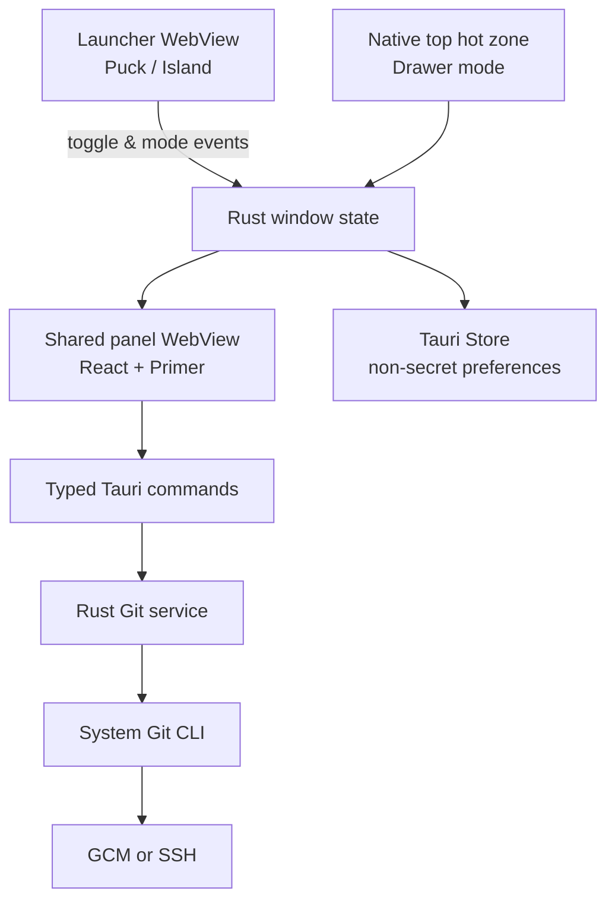

# RepoPuck 🟢

<p align="center">
  
</p>

<p align="center">
  <strong>Small on screen. Fast in flow.</strong><br>
  A lightweight Windows Git companion for the commits that should take seconds.
</p>

<p align="center">
  <a href="https://github.com/YYchainsAw/RepoPuck/releases/latest"></a>
  <a href="https://github.com/YYchainsAw/RepoPuck/actions/workflows/ci.yml"></a>
  
  
  
</p>

> 中文简介：RepoPuck 是一个常驻桌面的轻量 Git 助手，让你无需切回 IDE 就能选择文件、切换分支、提交并推送。🚀

RepoPuck stays close without becoming a full Git client. Open a repository, review tracked and unversioned changes separately, stage only the files that belong together, then choose **Commit** or **Commit & Push**.

## ✨ Why RepoPuck?

- ⚡ **Fast everyday flow** — stage, commit, push, fetch, pull, stash, and switch branches from a compact panel.
- 🎯 **Focused by design** — common Git actions stay prominent; advanced actions live in the More menu.
- 🖥️ **Desktop-native behavior** — tray integration, always-on-top launchers, multi-monitor placement, DPI awareness, and restored geometry.
- 🧩 **Three ways to stay nearby** — use a draggable puck, a top island, or an auto-revealing top drawer.
- 🌗 **GitHub-inspired UI** — Primer components and tokens in light, dark, or system theme.
- 🔐 **No GitHub account required** — RepoPuck reuses your existing Git, Git Credential Manager, or SSH setup.

## 🧭 Three shell modes

Choose a mode from **More → Settings → Launch mode**. The full Git workspace is shared across all three, so switching modes never changes your repository or staged files.

| Mode | How it behaves | Best for |
| --- | --- | --- |
| 🟢 **Floating puck** | A draggable 58 × 58 desktop puck. Click once to open the panel and again to close it. The puck attaches to the best panel corner. | A visible, movable Git shortcut |
| ⬛ **Top island** | A compact GitHub-style capsule stays centered at the top of the active display. Click it to drop the panel directly underneath. | A stable launcher that never covers the sides of the screen |
| 📜 **Top drawer** | The launcher disappears. Move the pointer to the top-center hot zone and pause briefly; the panel rolls down and hides after the pointer leaves. | A nearly invisible workspace with maximum desktop space |

The drawer uses a native cursor hot zone instead of a transparent WebView strip, so the hidden mode does not block clicks near the top of the desktop. Keyboard and tray access remain available as a fallback.

## 🖼️ Interface

The panel follows GitHub Primer while borrowing JetBrains' useful separation between tracked and unversioned files.

| Light | Dark |
| --- | --- |
|  |  |

The v0.1.2 icon direction combines the RepoPuck name with a docked three-node Git mark:


Visual comparisons, responsive evidence, and interaction-state checks live in [design-qa.md](design-qa.md).

## ✅ Git workflow

- 📂 Select a local repository or reopen one from the recent list.
- 👀 Review **Changes** and **Unversioned files** as separate groups.
- ☑️ Stage or unstage individual files and groups.
- 🌿 Switch branches or create a new local branch.
- 💬 Write a commit message with a focused 72-character guide.
- ✅ Commit locally without pushing.
- 🚀 Commit and push with a separate primary action.
- ✏️ Amend the most recent local commit without automatic force-push.
- 🔄 Fetch, pull, push, stash, and refresh.
- 🗂️ Open the repository in Explorer or a terminal.

Merge, rebase, cherry-pick, destructive reset, conflict editing, remote management, and force-push remain intentionally outside the focused workflow.

## 📦 Install the stable release

1. Download the MSI from the [latest GitHub Release](https://github.com/YYchainsAw/RepoPuck/releases/latest).
2. Run the installer.
3. Open RepoPuck from the Start menu or tray.
4. Choose a repository and make sure `git fetch` or `git push` already works in your terminal.

> [!IMPORTANT]
> Development installers are currently unsigned. Windows may show **Unknown publisher** or a Microsoft Defender SmartScreen warning. Verify the checksum shown in the Release notes before installing.

RepoPuck targets Windows 10 and Windows 11 and requires:

- [Git for Windows](https://gitforwindows.org/) on `PATH`.
- Microsoft Edge WebView2 Runtime, included with supported Windows versions.
- Existing HTTPS credentials through Git Credential Manager, or an SSH agent/key, for remote operations.

## 🛠️ Technology stack

| Layer | Technology | Role |
| --- | --- | --- |
| Desktop shell | **Tauri 2** | Native windows, system tray, IPC, packaging, and application lifecycle |
| Native core | **Rust 2021** | Git orchestration, input validation, window geometry, persistence, and process safety |
| UI | **React 19 + TypeScript 5.8** | Panel, launchers, settings, transitions, and typed client boundaries |
| Design system | **GitHub Primer React + Octicons** | Accessible controls, icons, themes, and GitHub-style visual language |
| Build tooling | **Vite 6 + pnpm 10** | Fast development, locked dependencies, and production frontend builds |
| Testing | **Vitest + Testing Library + Rust tests** | UI behavior, parser, Git service, geometry, and state-machine coverage |
| Git engine | **System Git CLI** | Repository status and local/remote Git operations |
| Windows runtime | **WebView2 + Windows APIs** | Hardware-accelerated rendering, job objects, no-console processes, and cursor hot zones |
| Automation | **GitHub Actions** | Frontend checks, Rust checks, and verified Windows MSI builds |

## 🏗️ Architecture



Two WebViews are reused across all modes:

- The lightweight launcher WebView renders the puck or top island. It is hidden in drawer mode.
- The panel WebView renders the only full Git workspace and changes only its placement and transition.

Blocking Git work runs outside the WebView command thread. Commands disable terminal prompting, hide console windows, bound captured output, and place each process tree in a Windows Job Object so timeouts stop helper and transport processes as well.

Read [docs/architecture.md](docs/architecture.md) for the detailed component map and safety boundaries.

## 🔐 Authentication and privacy

RepoPuck does **not** ask you to sign in to GitHub and does not store GitHub tokens, passwords, SSH keys, or Git credentials.

Remote commands delegate authentication to your existing Git configuration:

- 🔑 HTTPS through Git Credential Manager.
- 🗝️ SSH through your configured agent and keys.

If `git push` works in a terminal for the selected repository, RepoPuck uses the same credential path. If it does not, complete authentication once in a terminal and retry.

Only non-secret preferences are persisted: theme, pin state, shell mode, panel size, launcher geometry, selected display, and a bounded recent-repository list.

## 👩‍💻 Development

### Prerequisites

- Node.js 22
- pnpm 10.18.3
- Rust 1.97.1 with the MSVC toolchain
- Microsoft C++ Build Tools with **Desktop development with C++** and a Windows SDK
- Git for Windows
- WebView2 Runtime
- Windows **VBSCRIPT** optional feature for MSI packaging

### Clone and run

```powershell
git clone https://github.com/YYchainsAw/RepoPuck.git
Set-Location RepoPuck
git checkout develop
pnpm install --frozen-lockfile
pnpm tauri dev
```

For UI work with deterministic demo data and no real repository writes:

```powershell
pnpm dev
```

### Quality gates

```powershell
pnpm lint
pnpm typecheck
pnpm test
pnpm build

Push-Location src-tauri
cargo fmt --check
cargo clippy --locked --all-targets -- -D warnings
cargo test --locked
Pop-Location
```

GitHub Actions runs the same frontend and Rust checks and produces a verified Windows MSI artifact.

### Package a release build

```powershell
pnpm tauri build --bundles msi
```

Do not distribute a local installer until automated checks, visual QA, runtime smoke tests, and checksum verification have passed.

## 🗺️ Roadmap

- [x] 🟢 Floating puck with four-corner docking
- [x] 📐 Resizable panel with restored geometry
- [x] 🌗 Light, dark, and system themes
- [x] 📦 Signed-off CI pipeline and GitHub Release workflow
- [x] ⬛ Top island mode
- [x] 📜 Auto-revealing top drawer mode
- [ ] 🔏 Windows code signing
- [ ] ⌨️ Configurable global keyboard shortcut
- [ ] 🔔 Optional push/fetch notifications
- [ ] 🌍 Additional interface languages

## 🤝 Contributing

Read [CONTRIBUTING.md](CONTRIBUTING.md) before making changes. RepoPuck uses small, coherent commits based on `develop`; commits are intentionally more frequent than pushes.

Bug reports and focused feature ideas are welcome in [GitHub Issues](https://github.com/YYchainsAw/RepoPuck/issues). Please include your Windows version, display scaling, shell mode, and reproduction steps for window-placement bugs.

## 📄 License

No license has been selected yet. Until one is added, all rights are reserved by the repository owner.
