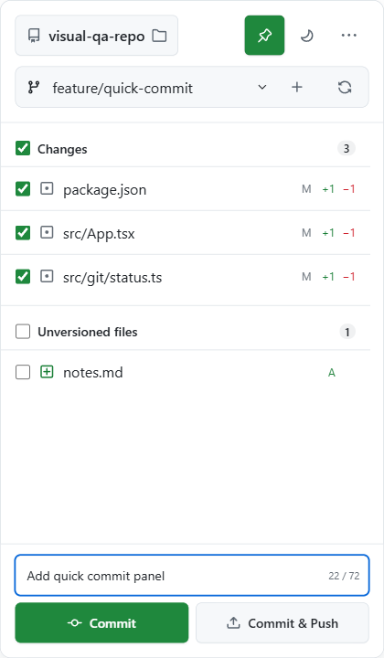
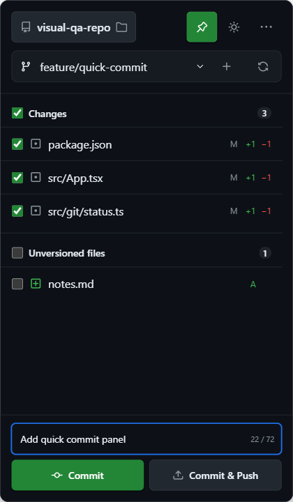
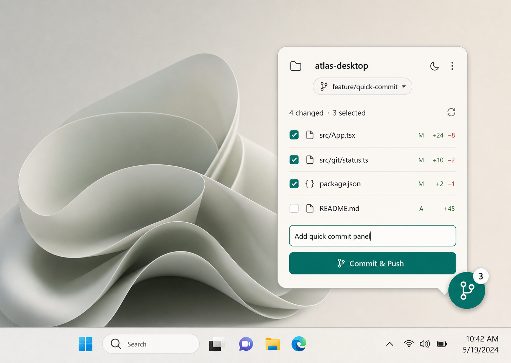

# RepoPuck

RepoPuck is a lightweight Windows Git companion for the part of the workflow that should take seconds: review changed files, stage only what belongs together, switch branches, commit, and push. It lives in the system tray and can expose a draggable desktop puck or a compact GitHub Primer-style panel.

> Small on screen. Fast in flow.

RepoPuck is currently a pre-release v0.1 project. Development happens on the `develop` branch.

## What v0.1 covers

- A 58 × 58 always-on-top puck and a compact, resizable Git panel.
- Repository selection, status refresh, tracked/untracked change groups, and per-file staging.
- Local branch switching and branch creation.
- Separate `Commit` and `Commit & Push` actions.
- A guarded `Amend last commit` action that can keep or replace the message, includes staged files, and never pushes automatically.
- Fetch, pull, push, stash, and shortcuts to the repository in Explorer or a terminal.
- Light, dark, and system themes; pin state; recent repositories; and restored puck position.
- Native Git execution through Tauri and Rust, with a browser demo client for interface development.

Merge, rebase, cherry-pick, destructive reset, conflict editing, remote management, and history rewriting beyond the guarded single-commit Amend flow are intentionally outside the v0.1 scope. RepoPuck is a focused companion, not a replacement for a full Git client.

## Design direction

The interface uses GitHub Primer tokens and components, with JetBrains-inspired separation between tracked changes and unversioned files. These captures come from the real Tauri/WebView2 application at the production 420 × 720 panel size.





The approved light-panel design reference remains the primary visual source:



The full comparison history and responsive/state evidence are recorded in [design-qa.md](design-qa.md).

## GitHub login and authentication

RepoPuck does **not** ask you to sign in to GitHub and does not store GitHub tokens, passwords, SSH keys, or Git credentials.

Local operations use the `git` executable installed on your system. When a remote operation needs authentication, Git delegates it to your existing setup—typically Git Credential Manager over HTTPS or your configured SSH agent and keys. RepoPuck disables terminal prompting, launches Git without a console window, bounds command output, and places each operation in a Windows Job Object before execution so a timeout stops the complete helper/transport process tree. It also explicitly targets the branch's configured tracking remote/ref instead of relying on ambient push defaults. If `git push` works in a terminal for the repository, RepoPuck uses the same credential path.

RepoPuck does not open an interactive credential prompt inside its compact panel. If authentication is not configured yet, complete a `git fetch` or `git push` in a terminal first, then retry the operation in RepoPuck.

The app persists only non-secret preferences: theme, pin state, puck position, and a bounded recent-repository list whose first entry restores the selected repository at startup.

## Windows prerequisites

RepoPuck v0.1 targets Windows. To build it locally, install:

- [Git for Windows](https://gitforwindows.org/) and make sure `git` is on `PATH`.
- [Node.js](https://nodejs.org/) 22 and pnpm 10.18.3 (the versions used by CI).
- [Rust](https://www.rust-lang.org/tools/install) stable with the MSVC toolchain.
- Microsoft C++ Build Tools with **Desktop development with C++** and a Windows SDK.
- Microsoft Edge WebView2 Runtime. It is included with supported Windows versions, but it can also be installed separately.
- The Windows **VBSCRIPT** optional feature when building the configured MSI target. It is enabled on most installations; see Tauri's [Windows prerequisites](https://v2.tauri.app/start/prerequisites/#windows) if `light.exe` fails.

After installing Node.js, pnpm can be activated with Corepack:

```powershell
corepack enable
corepack prepare pnpm@10.18.3 --activate
```

See the [Tauri prerequisites](https://v2.tauri.app/start/prerequisites/) if a native build reports a missing Windows component.

## Development

Clone the repository, check out `develop`, and install the locked dependencies:

```powershell
git clone https://github.com/YYchainsAw/RepoPuck.git
Set-Location RepoPuck
git checkout develop
pnpm install --frozen-lockfile
```

Run the native Tauri application:

```powershell
pnpm tauri dev
```

For faster interface work without native commands, run the browser demo client:

```powershell
pnpm dev
```

Vite prints the local preview URL. Browser mode uses in-memory demo data and does not modify a real repository.

## Quality checks

Run the frontend gates from the repository root:

```powershell
pnpm lint
pnpm typecheck
pnpm test
pnpm build
```

Run the Rust gates from `src-tauri`:

```powershell
Push-Location src-tauri
cargo fmt --check
cargo clippy --locked --all-targets -- -D warnings
cargo test --locked
Pop-Location
```

The same checks run in Windows CI. Tests that exercise Git create temporary repositories and configure identities locally; they do not use your repositories or credentials.

## Native builds

Create a debug package while developing:

```powershell
pnpm tauri build --debug
```

Create a release package only after the full test and visual-QA gates have passed:

```powershell
pnpm tauri build
```

Tauri prints the generated artifact paths when the command completes. Confirm those paths and test the resulting installer on Windows before distributing it; this README does not claim an installer location until release packaging has been verified.

CI also performs a release MSI build on `windows-2022` using the locked pnpm dependencies. It verifies that a single non-empty MSI was created and uploads that installer as a workflow artifact for seven days. This is validation only: the workflow does not publish a GitHub Release or distribute the installer.

Development installers are currently unsigned. Windows may show an **Unknown publisher** or Microsoft Defender SmartScreen warning; release code signing is not configured yet, so distribute builds with a reviewed source revision and checksum.

## Architecture at a glance

```text
React + TypeScript panel/puck
          │ typed GitClient / native shell client
          ▼
      Tauri invoke/events
          │
          ├── Rust Git service ──> system git ──> GCM or SSH for remotes
          ├── native windows and tray
          └── Tauri store (non-secret preferences only)
```

The frontend owns rendering, transient interaction state, and theme/pin/recent-repository preferences written through the Tauri Store plugin. Rust owns bounded/non-interactive Git process execution, exact literal-path staging validation, explicit remote targeting, repository validation, native window/tray behavior, puck-position persistence, and startup restoration. The webviews run with a restrictive content-security policy and no filesystem-plugin capability. The frontend talks to typed client boundaries, allowing tests and browser development to substitute deterministic in-memory implementations.

Read [docs/architecture.md](docs/architecture.md) for the component map, command flow, persistence rules, and safety boundaries.

## Contributing

Please read [CONTRIBUTING.md](CONTRIBUTING.md) before making changes. RepoPuck uses small, coherent commits on branches based on `develop`; pushes are intentionally less frequent than commits.

## License

No license has been selected yet. Until one is added, all rights are reserved by the repository owner.
