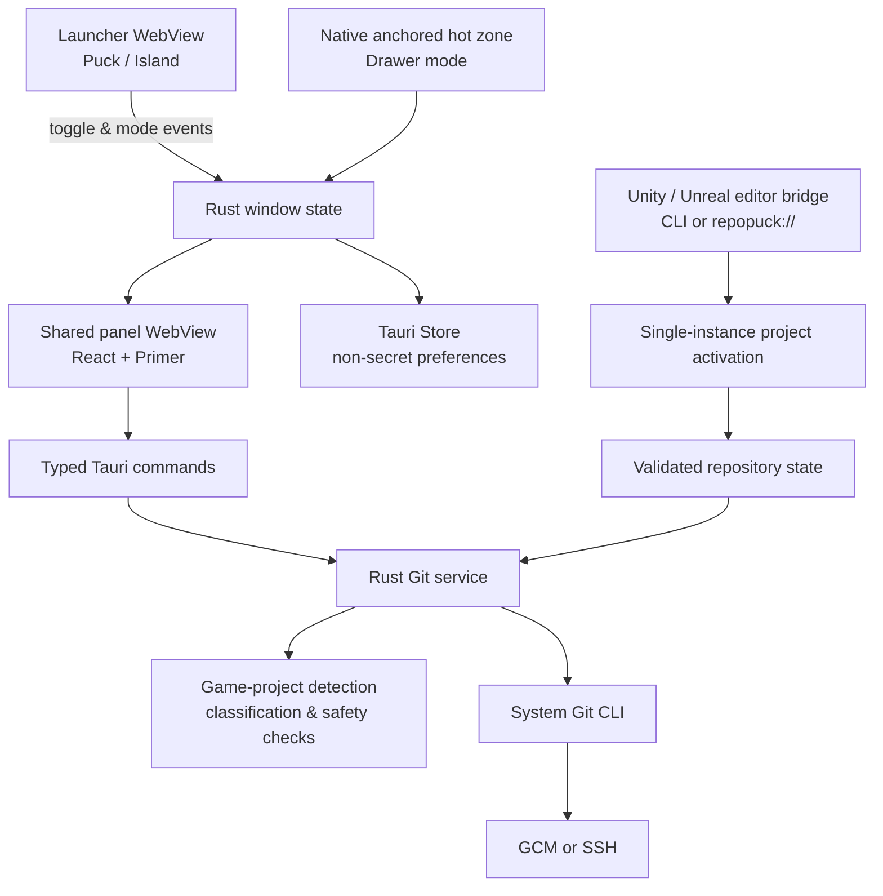

# RepoPuck 🟢

<p align="center">
  
</p>

<p align="center">
  <strong>Small on screen. Fast in flow.</strong><br>
  A lightweight Windows Git companion for the commits that should take seconds.
</p>

<p align="center">
  <a href="https://github.com/YYchainsAw/RepoPuck/releases/latest"></a>
  <a href="https://github.com/YYchainsAw/RepoPuck/actions/workflows/ci.yml"></a>
  
  
  
</p>

> 中文简介：RepoPuck 是一个常驻桌面的轻量 Git 助手，让你无需切回 IDE，就能选择文件、切换分支、提交并推送；`develop` 预览版还会识别 Unity 与 Unreal 项目，特别适合 Visual Studio、Unity 和 UE 蓝图工作流。🎮🚀

RepoPuck stays close without becoming a full Git client. Open a repository, review tracked and unversioned changes separately, stage only the files that belong together, then choose **Commit** or **Commit & Push**.

## 🚦 Project status

| Channel | Version | Source | Status |
| --- | --- | --- | --- |
| ✅ **Stable** | `v0.1.2` | [`v0.1.2` tag](https://github.com/YYchainsAw/RepoPuck/releases/tag/v0.1.2) | Released and recommended for normal use. Includes the floating puck workflow. |
| 🧪 **Preview** | `v0.2.0` | [`develop` branch](https://github.com/YYchainsAw/RepoPuck/tree/develop) | Adds three shell modes plus Unity/Unreal detection, game-aware change groups, safety checks, and editor wake-up bridges. It has not been published. |

> [!IMPORTANT]
> The latest stable MSI is still `v0.1.2`. The shell-mode baseline completed local packaged-app QA on Windows 11 at 175% scaling, and the subsequent [`e82e240` CI run](https://github.com/YYchainsAw/RepoPuck/actions/runs/29917798861) passed frontend checks, Rust checks, and Windows MSI packaging. The newer game-project workflow remains a `develop` preview and must pass the same automated, packaged-app, and real-editor checks before release. No 100%, mixed-DPI, or negative-coordinate hardware run is claimed.

## ✨ Why RepoPuck?

- ⚡ **Fast everyday flow** — stage, commit, push, fetch, pull, stash, and switch branches from a compact panel.
- 🎯 **Focused by design** — common Git actions stay prominent; advanced actions live in the More menu.
- 🖥️ **Desktop-native behavior** — tray integration, always-on-top launchers, multi-monitor placement, DPI awareness, and restored geometry.
- 🧩 **Three ways to stay nearby** — the stable puck is joined on `develop` by a top island and an auto-revealing top drawer.
- 🎮 **Game-project awareness** — the `develop` preview recognizes Unity and Unreal repositories, organizes engine files by purpose, and surfaces common commit risks.
- 🔗 **Open with the project** — optional Unity and Unreal editor bridges wake RepoPuck and select the project repository through a local deep link.
- 🌗 **GitHub-inspired UI** — Primer components and tokens in light, dark, or system theme.
- 🔐 **No GitHub account required** — RepoPuck reuses your existing Git, Git Credential Manager, or SSH setup.

## 🧭 Three shell modes

The three-mode selector is currently available in the `v0.2.0` preview on `develop`. Choose a mode from **More → Settings → Launch mode**. The full Git workspace is shared across all three, so switching modes does not change the selected repository or staged files.

| Mode | Availability | How it behaves | Best for |
| --- | --- | --- | --- |
| 🟢 **Floating puck** | Stable in `v0.1.2` | A draggable 58 × 58 desktop puck. Click once to open the panel and again to close it. The puck attaches to the best panel corner. | A visible, movable Git shortcut |
| 🏝️ **Top island** | Preview in `v0.2.0` | A 260 × 52 launcher window sits flush with the selected display's work-area top. Its 260 × 48 surface has a flat top edge, rounded lower corners, and a 4 px shadow area. Click it to drop the panel directly underneath. | A fixed launcher that avoids the sides of the screen |
| 📜 **Top drawer** | Preview in `v0.2.0` | The launcher disappears. Reveal the panel from its top-edge hot zone, then drag its handle left or right along the display top. Its vertical position stays locked. | A nearly invisible workspace with a remembered reveal position |

The drawer uses a native cursor hot zone instead of a transparent WebView strip, so the hidden mode does not block clicks near the top of the desktop. Its horizontal position is saved as a normalized anchor for each display, and the hidden hot zone follows that anchor. For keyboard-only access, press **Win+B**, select RepoPuck in the system tray, and choose **Open panel**.

> [!TIP]
> **Keyboard path for Top Drawer:** RepoPuck does not register a global shortcut yet. Press **Win+B** to focus the Windows notification area, use the arrow keys to reach **RepoPuck**, press **Shift+F10** (or the Menu key), select **Open panel**, and press **Enter**. This tray command opens the same shared panel without requiring pointer access to the top-edge hot zone.

## 🖼️ Interface

The panel follows GitHub Primer while borrowing JetBrains' useful separation between tracked and unversioned files.

| Light | Dark |
| --- | --- |
|  |  |

The v0.1.2 icon direction combines the RepoPuck name with a docked three-node Git mark:


The images above document the released `v0.1.2` panel. The completed local `v0.2.0` shell-mode evidence, candidate hashes, measurements, and hardware limits live in [docs/design-qa.md](docs/design-qa.md).

### 🧪 `v0.2.0` preview surfaces

| 🏝️ Attached top island | ↔️ Movable top drawer |
| --- | --- |
|  |  |

These are packaged-app captures from the local candidate, not images from the stable `v0.1.2` installer.

## ✅ Git workflow

- 📂 Select a local repository or reopen one from the recent list.
- 👀 Review **Changes** and **Unversioned files** as separate groups.
- ☑️ Stage or unstage individual files and groups.
- 🌿 Switch branches or create a new local branch.
- 💬 Write a commit message with a focused 72-character guide.
- ✅ Commit locally without pushing.
- 🚀 Commit and push with a separate primary action.
- ✏️ Amend the most recent local commit without automatic force-push.
- 🔄 Fetch, pull, push, stash, and refresh.
- 🗂️ Open the repository in Explorer or a terminal.

Merge, rebase, cherry-pick, destructive reset, conflict editing, remote management, and force-push remain intentionally outside the focused workflow.

## 🎮 Unity and Unreal workflow

Game-project support is currently available from `develop`; it is not included in the stable `v0.1.2` installer. RepoPuck recognizes a project when the explicitly selected directory, or one of its ancestors up to the enclosing Git root, matches one of these layouts:

- **Unity** — project-level `Assets` and `ProjectSettings` directories. RepoPuck reads `ProjectSettings/ProjectVersion.txt` when available.
- **Unreal Engine** — a project-level `.uproject` file plus at least one of `Content`, `Config`, `Source`, or `Plugins`. RepoPuck reads `EngineAssociation` when available.

Detected projects keep unversioned files separate while organizing tracked or staged changes into **Code**, **Scenes & Blueprints**, **Assets**, **Configuration**, **Generated files**, and **Other changes**. Ordinary Git repositories retain the simpler **Changes** and **Unversioned files** layout.

A Unity or Unreal project may live in a Git repository subdirectory. Select that project directory explicitly—both editor bridges already do this—and RepoPuck will run Git from the enclosing repository root while keeping the detected project directory as `selectionPath` for recent-project restoration. RepoPuck deliberately does not scan every child of a monorepo when only its Git root is selected.

### 🛡️ Game project checks

The panel adds a collapsible safety summary for the current changed files:

- 🧩 **Unity `.meta` integrity** — flags an asset with no `.meta`, an orphaned `.meta`, or an asset/`.meta` pair where only one changed side is staged.
- 🧹 **Generated output** — warns about changed files inside Unity `Library`, `Temp`, `Logs`, build output, and equivalent Unreal `Binaries`, `DerivedDataCache`, `Intermediate`, or `Saved` paths.
- 🐘 **Large files** — warns at 50 MiB and raises a danger-level notice at 100 MiB.
- 📦 **Git LFS candidates** — recommends LFS for common engine binary formats and for other asset or scene files at least 10 MiB.
- 🎯 **Staged-file truth** — reads staged sizes and content from Git index blobs, so the check describes what the next commit would contain even when the working-tree copy differs.
- ✅ **Verified LFS state** — a staged file is treated as LFS-safe only when the index contains both a matching `filter=lfs` attribute and a real canonical Git LFS pointer; a rule without a pointer, or a pointer without its staged rule, stays visible as a risk.

These checks are advisory. They help you review the staged set but do not rewrite `.gitignore` or `.gitattributes`, install Git LFS, stage companion files automatically, or block a commit.

### 🔗 Wake RepoPuck when an editor opens

The preview accepts an absolute or caller-relative repository path through either command-line form:

```powershell
.\repopuck.exe open "D:\Games\OrbitTactics"
.\repopuck.exe --repo "D:\Games\OrbitTactics"
```

An installed preview build also registers the local URI scheme:

```text
repopuck://open?path=D%3A%5CGames%5COrbitTactics
```

The `path` query value must be percent-encoded and use an absolute Windows drive-letter path such as `D:\Games\OrbitTactics`. Protocol links reject relative paths and direct UNC spellings such as `\\server\share`; mapped drive letters and junction targets remain subject to normal Windows resolution. The first protocol request for a path that is not already in RepoPuck's recent-project list shows the exact path and asks for confirmation; after an accepted path is validated and remembered, later editor launches can open it automatically.

The CLI forms are an explicit user-invoked interface rather than a link trust boundary. They may use caller-relative paths or other filesystem paths, including UNC paths, but every request still passes through normal Git repository validation. If RepoPuck is already running, the single-instance handler forwards an accepted request to that process, selects the enclosing repository, preserves a nested game project's `selectionPath`, and refreshes the shared panel. Otherwise the request takes precedence over recent-project restoration during startup.

Two thin, editor-only bridges are included:

| Editor | Install | Behavior |
| --- | --- | --- |
| 🟦 **Unity 2021.3+** | In Unity Package Manager choose **Add package from disk**, then select [`integrations/unity/com.repopuck.editor/package.json`](integrations/unity/com.repopuck.editor/package.json). | Sends one wake request per editor session. It is skipped in batch mode. |
| 🟪 **Unreal Editor on Win64** | Copy [`integrations/unreal/RepoPuckEditor`](integrations/unreal/RepoPuckEditor) to `<YourProject>/Plugins/RepoPuckEditor`, enable **RepoPuck Editor Bridge**, and restart the editor. | Sends a wake request after the editor engine initializes. It is skipped for commandlets and unattended runs and supports Blueprint-only projects. |

Neither bridge runs Git or stores repository state inside the editor. RepoPuck remains the only owner of repository validation, staging, commits, pushes, and safety checks. Install a `v0.2.0` preview build first—the stable `v0.1.2` installer does not register this protocol. See the [Unity bridge guide](integrations/unity/README.md) and [Unreal bridge guide](integrations/unreal/README.md) for the focused setup notes.

## 📦 Install the stable release

These instructions install `v0.1.2`, the current stable floating-puck release. The island, drawer, game-project checks, external project activation, and editor bridges are not part of this installer.

1. Download the MSI from the [latest GitHub Release](https://github.com/YYchainsAw/RepoPuck/releases/latest).
2. Run the installer.
3. Open RepoPuck from the Start menu or tray.
4. Choose a repository and make sure `git fetch` or `git push` already works in your terminal.

> [!IMPORTANT]
> Development installers are currently unsigned. Windows may show **Unknown publisher** or a Microsoft Defender SmartScreen warning. Verify the checksum shown in the Release notes before installing.

RepoPuck targets Windows 10 and Windows 11 and requires:

- [Git for Windows](https://gitforwindows.org/) on `PATH`.
- Microsoft Edge WebView2 Runtime, included with supported Windows versions.
- Existing HTTPS credentials through Git Credential Manager, or an SSH agent/key, for remote operations.

## 🛠️ Technology stack

| Layer | Technology | Role |
| --- | --- | --- |
| Desktop shell | **Tauri 2 + WebView2** | Native windows, system tray, IPC, packaging, and hardware-accelerated Windows rendering |
| Native core | **Rust 2021** | Git orchestration, game-project analysis, input validation, window geometry, persistence, and process safety |
| UI | **React 19.2 + TypeScript 5.8** | Shared panel, game-aware change groups, safety summaries, launchers, settings, transitions, and typed client boundaries |
| Design system | **GitHub Primer React + Octicons** | Accessible controls, icons, themes, and GitHub-style visual language |
| Build tooling | **Vite 6.4 + pnpm 10** | Fast development, locked dependencies, and production frontend builds |
| Testing | **Vitest 3 + Testing Library + Rust tests** | UI behavior, Git services, geometry, state-machine transitions, and accessibility contracts |
| Git engine | **System Git CLI** | Repository status and local/remote Git operations |
| Windows integration | **Windows APIs + Tauri plugins** | Job Objects, hidden console processes, DPI-aware geometry, drawer hot zones, deep links, and single-instance activation |
| Automation | **GitHub Actions** | Frontend checks, Rust checks, and verified Windows MSI builds |

## 🏗️ Architecture



Two WebViews are reused across all modes:

- The lightweight launcher WebView renders the puck or top island. It is hidden in drawer mode.
- The panel WebView renders the only full Git workspace and changes only its placement and transition.
- Both top modes keep the panel attached to the work-area top and therefore disable north-facing resize handles; drawer mode adds horizontal native dragging with a locked vertical coordinate.
- CLI and `repopuck://` activations converge on the same validated repository state. A second launch forwards its request to the existing process instead of creating another tray application.
- The Rust snapshot service detects supported game roots, classifies changed paths, and returns safety issues with the ordinary Git snapshot; editor bridges never receive Git capabilities.

Blocking Git work runs outside the WebView command thread. Commands disable terminal prompting, hide console windows, bound captured output, and place each process tree in a Windows Job Object so timeouts stop helper and transport processes as well. Read-only checks use a short timeout, while local mutations and remote operations receive longer limits so Git LFS filters and large game-project pushes are not killed after 30 seconds.

Read [docs/architecture.md](docs/architecture.md) for the detailed component map and safety boundaries.

## 🔐 Authentication and privacy

RepoPuck does **not** ask you to sign in to GitHub and does not store GitHub tokens, passwords, SSH keys, or Git credentials.

Remote commands delegate authentication to your existing Git configuration:

- 🔑 HTTPS through Git Credential Manager.
- 🗝️ SSH through your configured agent and keys.

If `git push` works in a terminal for the selected repository, RepoPuck uses the same credential path. If it does not, complete authentication once in a terminal and retry.

Only non-secret preferences are persisted: theme, pin state, shell mode, panel size, launcher geometry, selected display, per-display normalized drawer anchors, and a bounded recent-repository list.

## 👩‍💻 Development

The `develop` branch currently carries version `0.2.0`. Use tag `v0.1.2` when reproducing the stable release instead.

### Prerequisites

- Node.js 22
- pnpm 10.18.3
- Rust 1.97.1 with the MSVC toolchain
- Microsoft C++ Build Tools with **Desktop development with C++** and a Windows SDK
- Git for Windows
- WebView2 Runtime
- Windows **VBSCRIPT** optional feature for MSI packaging

### Clone and run

```powershell
git clone https://github.com/YYchainsAw/RepoPuck.git
Set-Location RepoPuck
git checkout develop
pnpm install --frozen-lockfile
pnpm tauri dev
```

For UI work with deterministic demo data and no real repository writes:

```powershell
pnpm dev
```

### Quality gates

```powershell
pnpm lint
pnpm typecheck
pnpm test
pnpm build

Push-Location src-tauri
cargo fmt --check
cargo clippy --locked --all-targets -- -D warnings
cargo test --locked
Pop-Location
```

GitHub Actions runs the same frontend and Rust checks and produces a verified Windows MSI artifact. The shell-mode baseline passed [CI #11](https://github.com/YYchainsAw/RepoPuck/actions/runs/29917798861); every newer preview change, including the game-project workflow, must pass a fresh run before it can become a release candidate.

### Package a release build

```powershell
pnpm tauri build --bundles msi
```

Do not distribute a local installer until automated checks, visual QA, runtime smoke tests, and checksum verification have passed.

## 🗺️ Roadmap

- [x] 🟢 Floating puck with four-corner docking
- [x] 📐 Resizable panel with restored geometry
- [x] 🌗 Light, dark, and system themes
- [x] 📦 Signed-off CI pipeline and GitHub Release workflow
- [x] 🏝️ Top island implementation on `develop`
- [x] 📜 Auto-revealing top drawer implementation on `develop`
- [x] ↔️ Per-display draggable drawer anchor and following hot zone on `develop`
- [x] 🧪 Complete local `v0.2.0` packaged-app QA at 175% scaling
- [x] ✅ Pass the post-QA shell-mode GitHub Actions gate on `e82e240`
- [x] 🎮 Unity and Unreal repository detection with semantic change groups
- [x] 🛡️ Unity `.meta`, generated-file, large-file, and Git LFS checks
- [x] 🔗 Single-instance CLI/deep-link activation and editor bridge source
- [x] 🧪 Validate nested Unity/Unreal projects and second-instance activation in a packaged build
- [ ] 🎮 Validate the optional bridges inside real Unity and Unreal editor sessions
- [ ] 📦 Publish the validated `v0.2.0` Release
- [ ] 🔏 Windows code signing
- [ ] ⌨️ Configurable global keyboard shortcut
- [ ] 🔔 Optional push/fetch notifications
- [ ] 🌍 Additional interface languages

## 🤝 Contributing

Read [CONTRIBUTING.md](CONTRIBUTING.md) before making changes. RepoPuck uses small, coherent commits based on `develop`; commits are intentionally more frequent than pushes.

Bug reports and focused feature ideas are welcome in [GitHub Issues](https://github.com/YYchainsAw/RepoPuck/issues). Please include your Windows version, display scaling, shell mode, and reproduction steps for window-placement bugs.

## 📄 License

No license has been selected yet. Until one is added, all rights are reserved by the repository owner.
