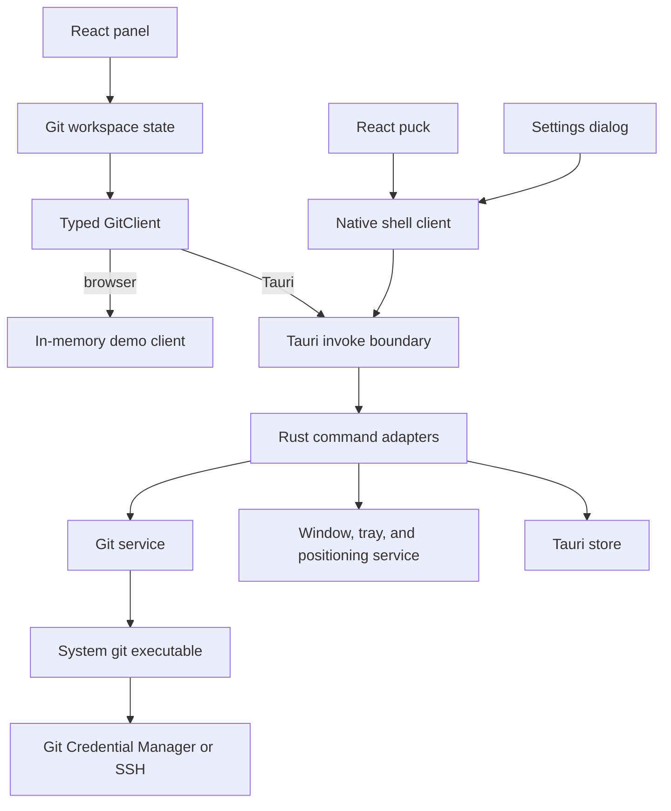
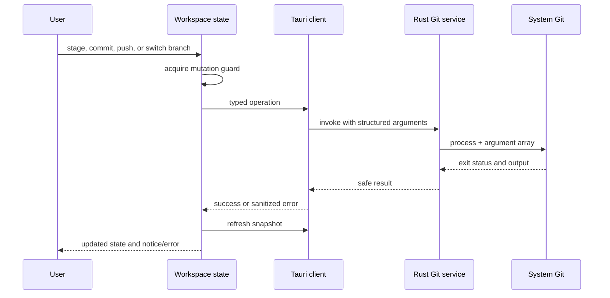

# RepoPuck architecture

RepoPuck is a Windows desktop application built with Tauri 2, Rust, React, and TypeScript. Its main architectural rule is simple: the frontend describes user intent, while the Rust side owns access to repositories, Git processes, native windows, and persisted application settings.

## System map

The browser demo and native application share the same React components. The demo client is deterministic and never touches a real repository; the packaged application selects the Tauri implementation at runtime.

## Frontend responsibilities

The frontend lives under `src/` and owns presentation plus short-lived interaction state.

| Area | Responsibility |
| --- | --- |
| `src/features/git/types.ts` | JSON-compatible repository, branch, change, and operation types. |
| `src/features/git/client.ts` | The `GitClient` contract and runtime client selection. |
| `src/features/git/demoClient.ts` | In-memory behavior for browser development and deterministic tests. |
| `src/features/git/tauriClient.ts` | Typed translation between `GitClient` calls and Tauri commands. |
| `src/features/git/GitProvider.tsx` and `useGitWorkspace.ts` | Snapshot refresh, polling, message state, mutation serialization, and notices/errors. |
| `src/features/git/` components | Change groups, rows, empty state, and commit composition. |
| `src/features/shell/` | Panel layout, puck, header, overflow actions, settings, theme, and native-shell interaction. |

UI components do not spawn Git or read the filesystem directly. Git-facing components consume workspace actions; native-shell components consume their typed native client. This separation keeps browser tests meaningful and makes native capabilities explicit.

## Rust responsibilities

The native code lives under `src-tauri/src/`.

| Area | Responsibility |
| --- | --- |
| `commands.rs` | Tauri command boundary, shared repository state, and conversion to serializable responses. |
| `git/runner.rs` | Direct `std::process::Command` execution of the system `git` binary. |
| `git/parser.rs` | Pure parsing for porcelain status and numstat data. |
| `git/service.rs` | Repository validation, staging, committing, pushing, branches, and safe secondary operations. |
| `git/model.rs` | Rust-side models matching the TypeScript wire format. |
| `windowing/` | Puck/panel lifecycle, work-area-safe placement, tray integration, and persisted shell state. |
| `lib.rs` | Plugin registration, managed state, command registration, and application startup. |

The Tauri command layer should remain thin. Git decisions belong in the service, parsing belongs in pure parser functions, and platform/window decisions belong in `windowing/`. This keeps behavior unit-testable without rendering the interface.

## Repository snapshot flow

1. The panel requests a refresh through the workspace state.
2. The Tauri client invokes `get_snapshot` with the selected repository.
3. Rust validates the repository and runs stable, machine-readable Git commands.
4. Porcelain and numstat parsers create a repository snapshot containing branches, ahead/behind state, and change entries.
5. The response crosses the Tauri boundary as camel-cased JSON and replaces the frontend snapshot only if it still belongs to the active repository/client generation.
6. While visible, the panel performs a single-flight refresh approximately every three seconds. Mutations are serialized so a poll cannot race a conflicting operation.

## Mutation flow

The commit message is cleared only after a successful commit. A failed commit or a commit that succeeds followed by a failed push retains enough state and feedback for the user to recover deliberately.

## Git execution and safety boundary

RepoPuck launches `git` directly with `std::process::Command` and a vector of arguments. It never constructs a shell command string. Commands that accept repository paths place `--` before user-controlled paths to prevent option injection.

Selected directories are validated with Git and canonicalized before becoming repository state. Machine-readable output is preferred (`--porcelain` and NUL-delimited records where applicable). Errors are converted into conservative, user-safe diagnostics; credential-bearing URLs, secrets, environment values, and unrelated process data must not cross into UI notices.

The v0.1 command surface covers repository selection/status, staging, committing, pushing with upstream setup, local branch switching/creation, fetch, pull, stash, and opening the repository in Explorer or a terminal. Merge, rebase, cherry-pick, destructive reset, conflict editing, remote management, and broad history rewriting do not cross this boundary in v0.1.

## Remote authentication

RepoPuck has no GitHub sign-in flow. When Git contacts a remote, the system `git` process uses the same configured credential helper or SSH setup it uses in a terminal. RepoPuck does not receive or persist GitHub tokens, passwords, SSH private keys, or credential-helper payloads.

This model intentionally supports GitHub, GitLab, self-hosted servers, and other Git remotes without adding provider-specific credential code. A remote operation can still fail if the user's terminal Git configuration cannot authenticate; RepoPuck reports a sanitized error and leaves credential repair to the system Git tooling.

## Native surfaces and lifecycle

RepoPuck has two native surfaces:

- The **puck** is a 58 × 58 transparent, undecorated, always-on-top launcher that stays out of the taskbar and displays the current change count.
- The **panel** defaults to 420 × 720 and remains usable at 360 × 560. It opens beside the puck when space permits and is clamped to the active monitor work area.

The tray owns application lifetime. Closing a surface hides it; it does not terminate the process. Explicit `Quit` from the tray menu exits. A pinned panel stays on top, while an unpinned panel can hide after losing focus.

Positioning is expressed as pure geometry first and then applied through Tauri window APIs. Tests cover each monitor edge so the panel cannot open outside the available work area.

## Persistence

The Tauri store contains only:

- Theme preference (`system`, `light`, or `dark`).
- Panel pin state.
- Monitor-relative puck position.
- Current repository path.
- A bounded list of recent repository paths.

These values are local convenience settings, not credentials. The store must never contain remote passwords, access tokens, SSH keys, Git credential material, commit content, or repository file content.

## Testing layers

- **Pure Rust tests** cover Git output parsing, argument construction, URL sanitization, and panel-positioning geometry.
- **Temporary-repository Rust tests** exercise validation, staging, unstaging, commits, branch state, and upstream-push decisions without touching a real project.
- **Vitest and Testing Library** cover client contracts, workspace concurrency/lifecycle behavior, component interactions, accessibility names, puck state, and settings.
- **Browser end-to-end checks** use the in-memory client for the complete 420 × 720 interaction flow.
- **Native smoke tests and visual QA** cover windows, tray behavior, monitor placement, light/dark states, and comparison with the approved design references.

Windows CI runs the deterministic frontend and Rust gates. Native packaging and visual QA remain explicit release gates because they require inspection of the produced Windows application, not just a successful unit-test job.

## Adding a Git operation

An operation is not complete until all layers agree:

1. Decide whether the operation belongs inside the current product and safety scope.
2. Add or extend the TypeScript `GitClient` contract and domain models.
3. Add a failing frontend state or interaction test.
4. Add Rust parser/service tests using a temporary repository.
5. Implement the Git service with fixed arguments and safe path handling.
6. Register a thin Tauri command and implement the typed adapter.
7. Add user feedback and recovery behavior, including preservation of useful state on failure.
8. Run frontend, Rust, native smoke, and visual checks appropriate to the change.

Operations that rewrite history, resolve conflicts, or manage credentials require a separate product and security design before implementation.
