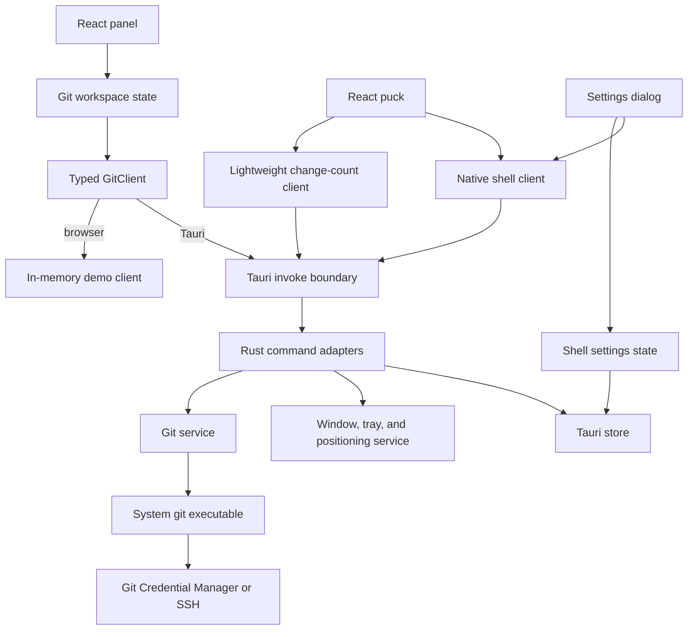
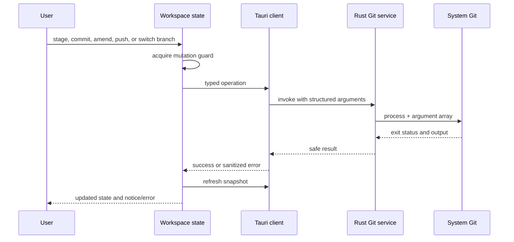

# RepoPuck architecture

RepoPuck is a Windows desktop application built with Tauri 2, Rust, React, and TypeScript. Its main architectural rule is simple: the frontend describes user intent, while Rust owns access to repositories, Git processes, and native windows. Non-secret settings use a shared Tauri Store boundary: the frontend manages theme, pin, and recent-repository preferences, while Rust restores native state and persists puck position.

## System map

The browser demo and native application share the same React components. The demo client is deterministic and never touches a real repository; the packaged application selects the Tauri implementation at runtime.

## Frontend responsibilities

The frontend lives under `src/` and owns presentation plus short-lived interaction state.

| Area | Responsibility |
| --- | --- |
| `src/features/git/types.ts` | JSON-compatible repository, branch, change, and operation types. |
| `src/features/git/client.ts` | The `GitClient` contract and runtime client selection. |
| `src/features/git/demoClient.ts` | In-memory behavior for browser development and deterministic tests. |
| `src/features/git/tauriClient.ts` | Typed translation between `GitClient` calls and Tauri commands. |
| `src/features/git/GitProvider.tsx` and `useGitWorkspace.ts` | Snapshot refresh, polling, message state, mutation serialization, and notices/errors. |
| `src/features/git/` components | Change groups, rows, empty state, and commit composition. |
| `src/features/shell/PanelWindow.tsx` | Native panel visibility observation, visible-only workspace lifecycle, and lazy panel loading. |
| `src/features/shell/PuckWindow.tsx` and `puckChangeCount.ts` | Lightweight puck lifecycle and single-flight changed-file count refresh. |
| `src/features/shell/` | Panel layout, puck gestures, header, overflow actions, settings, theme, and native-shell interaction. |

UI components do not spawn Git or read the filesystem directly. Git-facing components consume workspace actions; native-shell components consume their typed native client. This separation keeps browser tests meaningful and makes native capabilities explicit.

## Rust responsibilities

The native code lives under `src-tauri/src/`.

| Area | Responsibility |
| --- | --- |
| `commands.rs` | Tauri command boundary, shared repository state, and conversion to serializable responses. |
| `git/process.rs` | Windows no-console, suspended-start, Job Object, process-tree termination, and reader cancellation boundary. |
| `git/runner.rs` | Bounded, non-interactive orchestration of the system `git` binary and its output readers. |
| `git/parser.rs` | Pure parsing for porcelain status and numstat data. |
| `git/service.rs` | Repository validation, staging, committing, pushing, branches, and safe secondary operations. |
| `git/model.rs` | Rust-side models matching the TypeScript wire format. |
| `windowing/` | Puck/panel lifecycle, work-area-safe placement, tray integration, and persisted shell state. |
| `lib.rs` | Plugin registration, managed state, command registration, and application startup. |

The Tauri command layer should remain thin. Git decisions belong in the service, parsing belongs in pure parser functions, and platform/window decisions belong in `windowing/`. This keeps behavior unit-testable without rendering the interface.

## Repository snapshot flow

1. When the panel becomes visible, it requests a refresh through the workspace state.
2. The Tauri client invokes `get_snapshot`; the command reads the repository previously selected into managed Rust state.
3. Rust runs stable, machine-readable Git commands against that validated repository.
4. Porcelain and numstat parsers create a repository snapshot containing branches, ahead/behind state, and change entries.
5. The response crosses the Tauri boundary as camel-cased JSON and replaces the frontend snapshot only if it still belongs to the active repository/client generation and differs structurally from the current snapshot.
6. The visible panel performs a single-flight full refresh immediately and every 10 seconds. Hiding it clears that timer; showing it starts with a fresh snapshot. Mutations are serialized so a poll cannot race a conflicting operation.
7. The puck never loads the full workspace provider. It requests a lightweight changed-file count immediately and every 30 seconds, using one porcelain-status command and a single-flight guard.

## Mutation flow

The submitted message is cleared only after a successful commit or Amend, and only if the user has not typed a newer draft while the operation was pending. A failed commit or Amend preserves its draft. A commit that succeeds followed by a failed push retains explicit feedback so the user can recover deliberately.

## Git execution and safety boundary

RepoPuck launches `git` directly with `std::process::Command` and a vector of arguments. It never constructs a shell command string. Every blocking repository operation is dispatched through Tauri's blocking task pool, keeping the async command and native window event threads free while Git runs. On Windows, Git is created suspended and without a console window, assigned to a per-operation Job Object with kill-on-close, and only then resumed. Git stdin is closed, terminal prompting is disabled, and stdout/stderr are drained concurrently with a retained-output limit. A timeout terminates the complete Job Object process tree and hands the canceled readers to a reaper, so credential helpers or transports cannot keep the serialized repository operation locked. Commands that accept repository paths place `--` before paths and use literal pathspecs; the service also rejects any staging path that is not present in the current porcelain snapshot.

The full snapshot obtains upstream remote/ref metadata through the existing branch enumeration command instead of issuing repeated current-branch and configuration lookups. The puck's count path intentionally omits branch, remote, and numstat metadata.

At startup, recent-repository validation is also dispatched to the blocking pool. Native puck and tray setup can complete without waiting for `rev-parse`; a successful restore emits one refresh request to the webviews.

Selected directories are validated with Git and canonicalized before becoming repository state. Machine-readable output is preferred (`--porcelain` and NUL-delimited records where applicable). Push, fetch, and pull receive an explicit validated tracking remote/ref (or `origin` for first push) instead of inheriting ambient `push.default` or `remote.pushDefault` behavior. Errors are converted into conservative, user-safe diagnostics; credential-bearing URLs, secrets, environment values, and unrelated process data must not cross into UI notices.

The v0.1 command surface covers repository selection/status, staging, committing, guarded single-commit Amend, pushing with upstream setup, local branch switching/creation, fetch, pull, stash, and opening the repository in Explorer or a terminal. Amend requires confirmation and never triggers an automatic or forced push. Merge, rebase, cherry-pick, destructive reset, conflict editing, remote management, and broader history rewriting do not cross this boundary in v0.1.

## Remote authentication

RepoPuck has no GitHub sign-in flow. When Git contacts a remote, the system `git` process uses the same configured credential helper or SSH setup it uses in a terminal. RepoPuck does not receive or persist GitHub tokens, passwords, SSH private keys, or credential-helper payloads.

This model intentionally supports GitHub, GitLab, self-hosted servers, and other Git remotes without adding provider-specific credential code. The compact app does not host a terminal credential prompt. A remote operation can still fail if the existing helper or SSH setup cannot authenticate non-interactively; RepoPuck reports a sanitized error and leaves credential setup or repair to system Git tooling.

## Native surfaces and lifecycle

RepoPuck has two native surfaces:

- The **puck** is a 58 × 58 transparent, undecorated, always-on-top launcher that stays out of the taskbar and displays the current change count. It is keyboard-focusable without taking initial focus, and Enter/Space open the panel.
- The **panel** defaults to 420 × 720 and remains usable at 360 × 560. It opens beside the puck when space permits and is clamped to the active monitor work area.

The tray owns application lifetime. Closing a surface hides it; it does not terminate the process. Explicit `Quit` from the tray menu exits. A pinned panel stays on top, while an unpinned panel can hide after losing focus.

Both webviews use a restrictive production content-security policy. Capabilities are split per window: both can listen for shell events and access the non-secret settings store, only the panel can open the repository picker and read its own native visibility, and only the puck can initiate native dragging. RepoPuck does not register or expose the filesystem plugin to frontend code.

Positioning is expressed as pure geometry first and then applied through Tauri window APIs. Tests cover each monitor edge so the panel cannot open outside the available work area.

## Persistence

The Tauri store contains only:

- Theme preference (`system`, `light`, or `dark`).
- Panel pin state.
- Monitor-relative puck position.
- A bounded list of recent repository paths; the first entry is restored as the selected repository at startup.

These values are local convenience settings, not credentials. The store must never contain remote passwords, access tokens, SSH keys, Git credential material, commit content, or repository file content.

## Testing layers

- **Pure Rust tests** cover Git output parsing, argument construction, URL sanitization, and panel-positioning geometry.
- **Temporary-repository Rust tests** exercise validation, staging, unstaging, commits, branch state, and upstream-push decisions without touching a real project.
- **Vitest and Testing Library** cover client contracts, workspace concurrency/lifecycle behavior, component interactions, accessibility names, puck state, and settings.
- **Manual browser-demo smoke checks** can exercise the in-memory client without touching a repository.
- **Native smoke tests and visual QA** are release gates for windows, tray behavior, monitor placement, light/dark states, and comparison with the approved design references.

Windows CI runs the deterministic frontend and Rust gates, then performs a locked release MSI build, verifies that exactly one non-empty installer was produced, and uploads it as a short-lived workflow artifact. Native interaction smoke tests and visual QA remain explicit release gates because they require inspection of the produced Windows application, not just a successful build job.

## Adding a Git operation

An operation is not complete until all layers agree:

1. Decide whether the operation belongs inside the current product and safety scope.
2. Add or extend the TypeScript `GitClient` contract and domain models.
3. Add a failing frontend state or interaction test.
4. Add Rust parser/service tests using a temporary repository.
5. Implement the Git service with fixed arguments and safe path handling.
6. Register a thin Tauri command and implement the typed adapter.
7. Add user feedback and recovery behavior, including preservation of useful state on failure.
8. Run frontend, Rust, native smoke, and visual checks appropriate to the change.

Amend is the only approved v0.1 history rewrite and must retain its confirmation and no-force-push boundaries. Other operations that rewrite history, resolve conflicts, or manage credentials require a separate product and security design before implementation.
