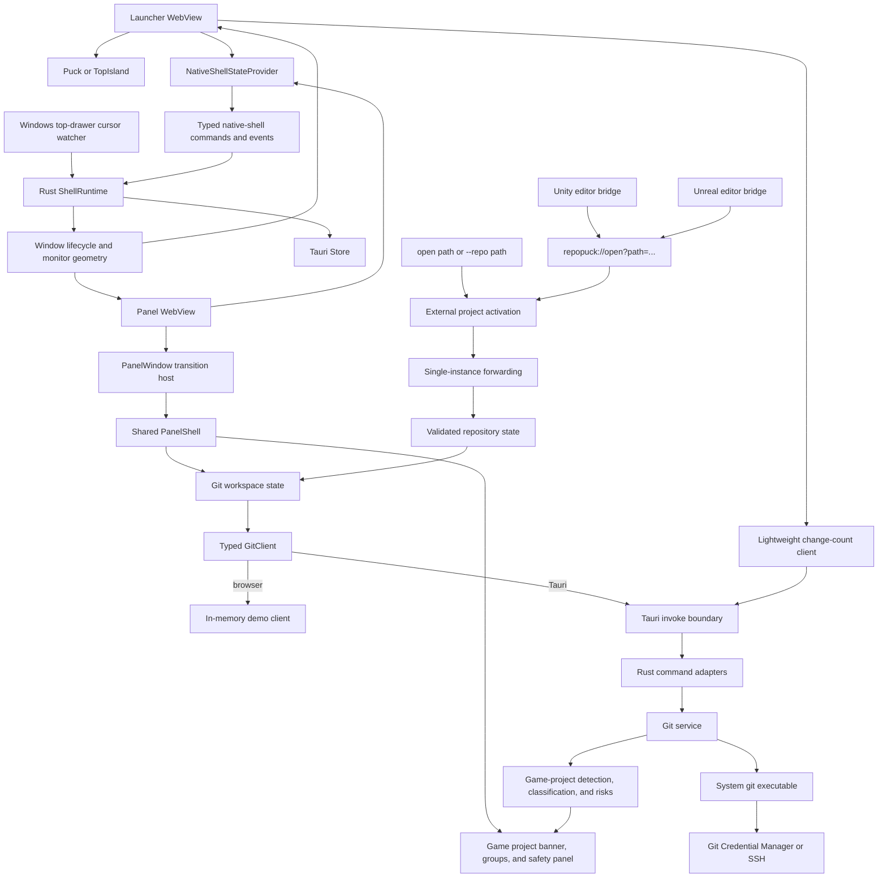
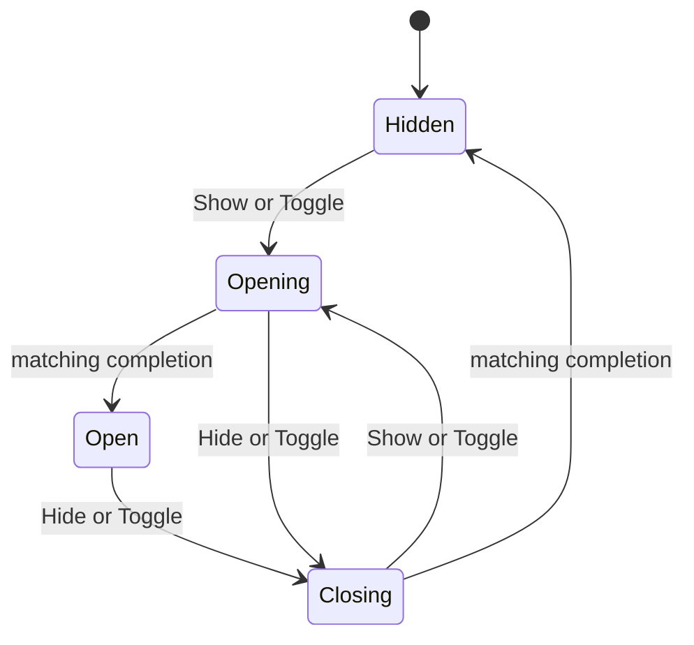
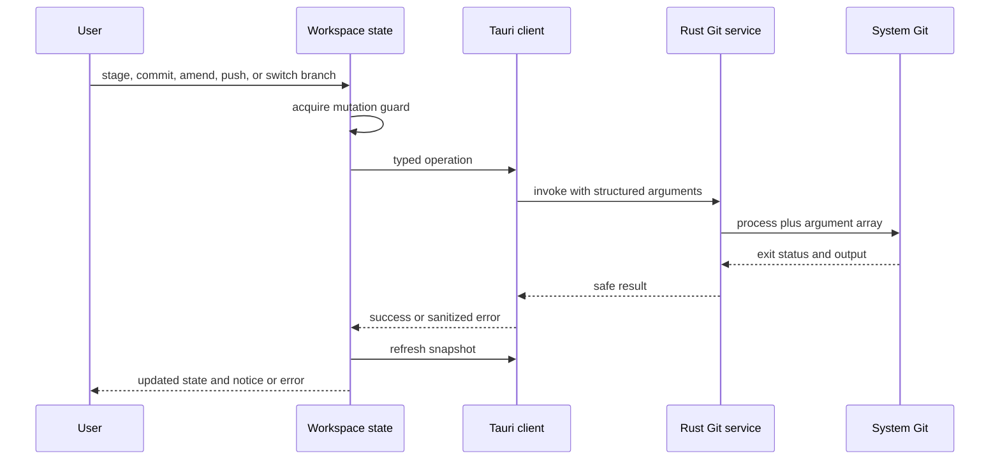

# RepoPuck architecture

RepoPuck is a Windows desktop application built with Tauri 2, Rust, React, and TypeScript. Its main architectural rule is simple: React describes user intent and renders the current state, while Rust owns repository validation, external project activation, Git processes, game-project analysis, shell-mode state, native windows, monitor geometry, and persistence of native placement.

> Version boundary: `v0.1.2` is the stable floating-puck release. This document describes the `v0.2.0` architecture currently implemented on `develop`, including the island and drawer modes plus the Unity/Unreal game-project workflow. The shell-mode baseline has local evidence in [`docs/design-qa.md`](design-qa.md) and passed [CI #11](https://github.com/YYchainsAw/RepoPuck/actions/runs/29917798861); the newer game-project additions remain preview work until their own packaged-app and real-editor validation is complete.

The application keeps one Git panel and one launcher WebView. The three shell modes change how those two native surfaces are configured; they do not create three separate Git interfaces:

- `puck` renders a draggable circular launcher and docks the panel to one of its four corners.
- `top-island` reuses the launcher WebView as a compact island flush with the work-area top and opens the panel below it.
- `top-drawer` hides the launcher WebView and lets a native Windows cursor watcher reveal the panel from a saved horizontal top-edge anchor.

## System map

The browser demo and packaged application share the same React components. The deterministic demo client never touches a real repository. The packaged application selects the Tauri client at runtime and uses `?view=panel` or `?view=puck` to select the role of each WebView.

## Shell modes and native surfaces

RepoPuck always creates two native Tauri windows, both transparent, undecorated, and omitted from the taskbar:

| Window | Role |
| --- | --- |
| `panel` | Hosts `PanelWindow`, the shared Git workspace, and `PanelShell`. It is hidden natively when its transition reaches `hidden`. |
| `puck` | Hosts `PuckWindow`. It is a 58 × 58 launcher in `puck`, a 260 × 52 top-center launcher window in `top-island`, and hidden in `top-drawer`. |

The shared panel is resizable from 360 × 560 through 720 × 960 logical pixels. `puck` mode respects the user's pin preference. The two top modes are always on top because their interaction model depends on remaining attached to the screen edge. Both `top-island` and `top-drawer` disable the north, north-east, and north-west resize handles so the panel remains anchored to the top edge.

### Puck mode

The puck is draggable and restores a monitor-relative position. Before opening, Rust evaluates all four puck-relative quadrants, chooses the largest quadrant that can contain the current panel, and then reserves enough work-area space for both the panel and the visible puck. The puck overlaps the selected panel corner by a small physical inset.

Placement uses two passes. Rust first estimates the outer frame on the target monitor, moves and sizes the hidden panel, then reads the real native outer bounds and performs the final clamped placement. Moving or resizing the visible panel reattaches the puck to the selected corner. Unchanged native positions are skipped to reduce work during resize drags.

### Top-island mode

The launcher WebView is resized to 260 × 52 logical pixels and centered flush with the selected monitor's work-area top. Its visible `TopIsland` button occupies 260 × 48 pixels; the remaining 4 pixels contain the CSS lower shadow. The button has a flat top edge with no upper corner radius and rounded lower corners, so it reads as attached to the display edge. It retains the lightweight changed-file count path used by the puck. Opening positions the panel below the complete 52-pixel launcher window so the two surfaces and shadow do not overlap. The transition anchor is `top-center` and the frontend uses the `island-drop` animation.

### Top-drawer mode

The launcher WebView is hidden. A dedicated Rust worker polls the Windows `GetCursorPos` API while this mode is active. It determines the cursor's monitor from physical monitor bounds, builds a DPI-scaled hot zone around that monitor's saved horizontal drawer anchor, and dispatches show or hide intents back to the main window thread.

The open drawer includes a dedicated drag handle. Primary-button dragging uses the native window drag operation, but every move is constrained back to the current monitor's work-area top: the horizontal coordinate is clamped to available travel and the vertical coordinate is locked. Rust converts the resulting horizontal position into a normalized `0.0`–`1.0` anchor and stores it per monitor. Resizing the drawer or changing DPI reconstructs the position from that normalized anchor rather than reusing stale pixels. The hidden hot zone reads the same anchor, so it follows the last visible drawer position.

The watcher uses these interaction guards:

- A 120 ms dwell in the top-edge hot zone is required before opening.
- The panel remains open while it is focused or the pointer is inside its padded bounds.
- A 500 ms leave delay prevents accidental closing while the pointer crosses a small gap.
- Re-entering the hot zone or panel reverses a closing transition immediately.
- Monitor samples are cached briefly; polling is faster while drawer mode is active and backs off while it is inactive.

The panel opens without stealing focus when the hover watcher triggers it. It returns to the saved anchored position at the top of the monitor where the hot zone was entered and uses the `drawer-roll` transition.

Top Drawer deliberately has no invisible focusable strip and RepoPuck does not register a global keyboard shortcut yet. The keyboard-only fallback is the Windows notification area: press **Win+B**, move to the RepoPuck tray icon with the arrow keys, open its context menu with **Shift+F10** or the Menu key, choose **Open panel**, and press **Enter**. The tray action sends an idempotent `Show` intent through the same Rust state machine, so it works even when the pointer hot zone is unavailable.

## External project activation and editor bridges

RepoPuck accepts three external-open forms that converge on the same repository-selection flow after source-specific input checks:

- `repopuck.exe open <path>`
- `repopuck.exe --repo <path>`
- `repopuck://open?path=<percent-encoded-path>`

`external_launch.rs` is a platform-independent parser for all three forms. It accepts either a complete process argument vector or arguments with the executable already removed, preserves Windows and Unicode paths, preserves literal `+` characters in URI values, and rejects missing or duplicate paths, extra CLI arguments, URI fragments or control characters, malformed percent encoding, invalid UTF-8, and NUL-containing URI paths. Protocol requests have the narrower boundary: the decoded value must use an absolute Windows drive-letter form, and normalized direct UNC spellings are rejected. The pure parser does not claim to distinguish a mapped network drive or a junction target; Windows resolves those after the first-use confirmation boundary. CLI `open` and `--repo` are explicit user-invoked forms, so they may use caller-relative or other filesystem paths, including UNC paths; relative CLI values are resolved from the caller's working directory. The bundled editor bridges send absolute drive-letter project paths in their normal configuration.

The Tauri deep-link plugin registers the `repopuck` desktop scheme for installed preview builds. Debug Windows and Linux builds call runtime scheme registration for development. On desktop, the single-instance plugin is registered before other plugins and includes deep-link support. This ordering ensures that an activation aimed at an already-running RepoPuck process is forwarded to the existing process rather than creating a second tray owner.

`project_activation.rs` connects parsed intent to application state:

1. A recognized startup request takes precedence over recent-repository restoration.
2. A recognized second-instance request is parsed with the caller's working directory.
3. CLI and preapproved protocol requests reserve a selection-intent generation before blocking work starts, so an older request cannot overwrite a newer repository choice merely because worker scheduling finishes out of order.
4. A protocol path already present in the bounded recent list is preapproved. An unknown protocol path records the current generation, displays a blocking warning with the exact path, and reserves only after confirmation if no newer user selection arrived. Cancelling the dialog therefore does not invalidate an in-progress repository choice.
5. The requested path passes through the same `RepositoryState::select` validation used by the repository picker.
6. A successful selection is persisted using the selected game-project path when available, not merely the enclosing Git root.
7. RepoPuck emits `refresh_requested`, allowing the existing panel workspace to reload without replacing either WebView.

Malformed requests, rejected or cancelled protocol paths, and unrelated process arguments are ignored safely. A confirmed path that fails Git repository validation produces a native error dialog without changing the selected repository. External activation selects and refreshes a repository; it does not bypass the shell state machine or grant the caller a generic command channel.

The source tree contains two optional, thin editor adapters:

| Integration | Runtime behavior | Boundary |
| --- | --- | --- |
| `integrations/unity/com.repopuck.editor` | An editor-only UPM package uses `InitializeOnLoad`, defers until the editor is ready, and launches one URI per non-batch editor session using `Application.dataPath`'s parent. | Does not invoke Git or hold credentials. Requires Unity 2021.3 or newer according to its package manifest. |
| `integrations/unreal/RepoPuckEditor` | A Win64 editor module loads at `PostEngineInit`, resolves `FPaths::ProjectDir()`, URL-encodes it, and launches the URI unless Unreal is running a commandlet or unattended. | Does not invoke Git or hold credentials. The plugin has no content and can be added to Blueprint-only projects. |

Both adapters delegate repository ownership to RepoPuck. They are intentionally small enough to remove without changing project source or Git configuration. The stable `v0.1.2` installer predates the custom protocol, so the adapters require a `v0.2.0` preview installation or an appropriately registered development build.

## Native shell state machine

Rust is the source of truth for shell behavior. `windowing/state.rs` defines:

- `ShellMode`: `Puck`, `TopIsland`, or `TopDrawer`.
- `PanelPhase`: `Hidden`, `Opening`, `Open`, or `Closing`.
- `PanelIntent`: `Show`, `Hide`, or `Toggle`.
- `ShellRuntime`: the active mode, phase, monotonically changing transition ID, active monitor, optional puck dock corner, drawer hover tracker, and per-monitor drawer anchors.

Every accepted intent increments `transitionId`. Rust emits both a `shell_state_changed` snapshot and a `panel_transition` payload containing the mode, direction, animation, anchor, and duration. `PanelWindow` keeps the native surface present for the closing animation and calls `complete_panel_transition` when the CSS animation ends. A native timer completes the same transition after its duration plus a small grace period if the WebView cannot acknowledge it.

Only a completion carrying the current transition ID can advance the phase. Rapid second clicks and hover re-entry can therefore reverse an in-flight animation without an older completion hiding a newly reopened panel. Changing modes invalidates the current transition, saves the outgoing geometry, reconfigures the launcher, restores the incoming mode's panel size, and reopens the panel only if it was logically open before the change.

Legacy `panel_opened` and `panel_visibility_changed` events remain a compatibility fallback. The richer shell snapshot and transition protocol is the primary path.

## Frontend responsibilities

The frontend lives under `src/` and owns presentation plus short-lived interaction state.

| Area | Responsibility |
| --- | --- |
| `src/App.tsx` and `src/main.tsx` | Select the panel or launcher view, load settings and native state before rendering, and avoid an initial flash of the wrong shell mode. |
| `src/features/shell/useNativeShellState.tsx` | Validate the native wire format, query the initial snapshot, subscribe to shell-state and transition events, expose `setMode`, and acknowledge completed transitions. |
| `src/features/shell/PuckWindow.tsx`, `Puck.tsx`, and `TopIsland.tsx` | Reuse the launcher WebView for puck and island modes, toggle the panel, and run only the lightweight change-count lifecycle. |
| `src/features/shell/PanelWindow.tsx` | Observe `PanelPhase`, host mode-specific open/close motion, keep Git polling tied to visibility, expose resize handles, and lazy-load the panel UI. |
| `src/features/shell/PanelShell.tsx` and `DrawerDragHandle.tsx` | Provide one shared Git interface for all three modes, insert game-project context above the change list when detected, and expose the drawer-only native drag affordance without duplicating the workspace. |
| `src/features/shell/SettingsDialog.tsx` | Select `puck`, `top-island`, or `top-drawer` and edit theme, pin, and recent-repository preferences. |
| `src/features/game/` | Render the Unity/Unreal project banner and accessible, collapsible safety summary for the risk records supplied by Rust. |
| `src/features/git/ChangeGroups.tsx` | Keep generic repositories split into tracked and unversioned changes; for detected game projects, split tracked or staged paths into semantic engine categories while preserving unversioned files as their own group. |
| `src/features/git/types.ts` | Define JSON-compatible repository, branch, change, game-project, risk, and operation types. |
| `src/features/git/client.ts` | Define the `GitClient` contract and runtime client selection. |
| `src/features/git/demoClient.ts` | Provide in-memory behavior for browser development and deterministic tests. |
| `src/features/git/tauriClient.ts` | Translate typed `GitClient` calls into Tauri commands. |
| `src/features/git/GitProvider.tsx` and `useGitWorkspace.ts` | Manage snapshot refresh, polling, mutation serialization, drafts, and notices or errors. |

Each WebView has its own `NativeShellStateProvider`. The provider subscribes before accepting a one-time state query, tracks event revisions to prevent a slower query from overwriting a newer event, and normalizes every payload at the boundary. Mode changes are read back from Rust rather than applied optimistically in React.

UI components never spawn Git or read the filesystem directly. Git-facing components consume workspace actions; native-shell components consume typed native clients. This keeps browser tests meaningful and makes native capabilities explicit.

## Rust responsibilities

The native code lives under `src-tauri/src/`.

| Area | Responsibility |
| --- | --- |
| `commands.rs` | Tauri command boundary, shared repository state, blocking-task dispatch, and serializable responses. |
| `external_launch.rs` | Pure parsing and validation for CLI and `repopuck://open` repository requests. |
| `project_activation.rs` | Startup precedence, caller-relative CLI resolution, protocol-path confirmation, selection-intent ordering, recent-list persistence, and refresh signaling. |
| `game_projects.rs` | Candidate-root Unity/Unreal detection, engine metadata, semantic path classification, Unity `.meta` integrity checks, and generated/large/LFS risk modeling. |
| `git/process.rs` | Windows no-console suspended start, Job Object ownership, process-tree termination, and reader cancellation. |
| `git/runner.rs` | Bounded, non-interactive orchestration of the system `git` binary, stdin batches, and output readers, including literal path batches after `--`. |
| `git/parser.rs` | Pure parsing for porcelain status and numstat data. |
| `git/service.rs` | Repository validation, nested game selection, staging, committing, pushing, branches, safe secondary operations, index-blob analysis, and staged/working-tree LFS resolution. |
| `git/model.rs` | Rust models matching the TypeScript snapshot, including optional `selectionPath`, game profiles, per-change categories, and safety issues. |
| `windowing/state.rs` | `ShellMode`, `PanelPhase`, transition IDs, reversible intents, drawer dwell/leave tracking, and per-monitor normalized anchors. |
| `windowing/drawer.rs` | Windows cursor polling, anchor-following per-monitor hot-zone detection, foreground ownership checks, and main-thread drawer intents. |
| `windowing/position.rs` | Pure physical geometry for puck docking, top attachment, normalized horizontal anchors, hot zones, fitting, and clamping. |
| `windowing/mod.rs` | Window orchestration, mode changes, transition events, DPI reflow, monitor selection, and native-state persistence. |
| `windowing/tray.rs` | Tray menu and explicit application lifetime controls. |
| `lib.rs` | Single-instance and deep-link plugin registration, managed state, command registration, startup, and window-event routing. |

The Tauri command layer remains thin. Git decisions belong in the service, parsing belongs in pure parser functions, state transitions belong in `windowing/state.rs`, and platform geometry belongs in `windowing/position.rs`. This keeps core behavior unit-testable without rendering the interface.

## DPI and multi-monitor layout

Native placement calculations use physical `Point`, `Size`, and `Rect` values because Windows monitor coordinates and work areas are physical and may include negative coordinates. User-facing dimensions and persisted panel sizes remain logical so the same preference is usable across monitors with different scale factors.

For every placement, RepoPuck chooses a target monitor, converts the desired logical size at that monitor's DPI, moves the hidden window so Windows applies the target DPI, measures the real outer frame, and then clamps the final position to the monitor work area. Scale-factor changes reflow visible surfaces. Tests cover mixed DPI, all four puck corners, negative monitor origins, screen-edge hot zones, native frame insets, and size bounds.

Top surfaces remember `topSurfaceMonitorName`. Monitor selection falls back from the saved name to the current window monitor, primary monitor, and finally the first available monitor. Top Drawer additionally stores a normalized horizontal anchor for each monitor, keyed by monitor name or by its bounds when no name is available. Entering the anchor-following hot zone updates the active monitor before showing the panel. Normalized travel keeps the drawer in the same relative horizontal location when its width or monitor DPI changes.

## Repository snapshot flow

1. When the panel becomes visible, it requests a refresh through the workspace state.
2. The Tauri client invokes `get_snapshot`; the command reads the repository previously selected into managed Rust state.
3. Rust runs stable, machine-readable Git commands against that validated repository.
4. Porcelain and numstat parsers create branches, ahead/behind state, and change entries.
5. A bounded inspection walks from the explicitly selected directory toward the enclosing Git root and decides whether one of those directories is a Unity or Unreal project. When detected, in-project changes receive semantic categories and the service derives game safety issues from changed paths, the Git index, on-disk metadata for unstaged files, and effective Git attributes.
6. The response crosses the Tauri boundary as camel-cased JSON and replaces the frontend snapshot only if it still belongs to the active repository/client generation and differs structurally from the current snapshot, including game metadata and risks.
7. The visible panel performs a single-flight full refresh immediately and every 10 seconds. Hiding it clears that timer; showing it starts with a fresh snapshot. Mutations are serialized so polling cannot race a conflicting operation.
8. The puck and island do not load the full workspace provider or perform game analysis. They request a lightweight changed-file count immediately and every 30 seconds with one porcelain-status command and a single-flight guard. Top-drawer mode hides the launcher view, so no launcher polling is needed while it is inactive.

## Game-project detection, classification, and safety

Game awareness is a read-only enrichment of the ordinary repository snapshot. It does not change the Git command surface and is absent (`null` profile, no categories, empty issue list) for ordinary repositories.

### Detection

Detection inspects each candidate directory's direct entries instead of recursively scanning a large project:

- Unity requires root-level `Assets` and `ProjectSettings`. The directory name becomes the project name, and `ProjectSettings/ProjectVersion.txt` supplies the editor version and descriptor when readable.
- Unreal requires a root-level `.uproject` and at least one conventional `Content`, `Config`, `Source`, or `Plugins` directory. The descriptor stem becomes the project name and its `EngineAssociation` supplies the version when readable. If several descriptors exist, a name matching the repository directory is preferred, followed by deterministic lexical order.

The selected directory may be the game root or a descendant of it, and the game root may itself be nested inside a larger Git repository. Git commands continue to run at the enclosing Git root; the snapshot returns the nested project as `repository.selectionPath`, and recent-project persistence keeps that path so a restart restores the game-aware view. Detection deliberately does not scan unrelated children of a monorepo: selecting only the outer Git root will not guess which nested game project the user intended.

### Semantic file categories

`classify_path` normalizes repository-relative separators and maps each changed path to one of six serialized values:

| Wire value | UI group | Examples |
| --- | --- | --- |
| `code` | **Code** | C++, C#, scripts, shaders, and related source extensions |
| `scene` | **Scenes & Blueprints** | Unity `.unity`, `.prefab`, and `.playable`; Unreal `.umap` and Blueprint-like `.uasset` paths or prefixes |
| `asset` | **Assets** | Unity `Assets` content, Unreal `Content`, engine object files, models, textures, audio, video, and fonts |
| `config` | **Configuration** | Unity `ProjectSettings`, package manifests, Unreal `Config`, project/plugin descriptors, IDE project files, `.meta`, and Git configuration files |
| `generated` | **Generated files** | Common VCS/IDE/build folders; Unity caches, logs, captures, and builds; Unreal `Binaries`, `DerivedDataCache`, `Intermediate`, and `Saved` at any path depth |
| `other` | **Other changes** | Paths that do not match a known convention |

Tracked changes and staged untracked changes use these semantic groups. Unstaged untracked files remain under **Unversioned files**, preserving the explicit staging boundary from the generic interface.

### Safety issue derivation

The service returns `warning` or `danger` records for the current changed paths:

- Unity asset paths under `Assets` are compared with their `.meta` companions. Missing or orphaned files are danger records. When both sides changed but only one side is staged, the selected side receives a warning.
- Any changed path classified as generated receives a warning. RepoPuck reports it but neither deletes the file nor changes ignore rules.
- Unstaged files use working-tree metadata for size checks. Staged files use the blob OID and size from `git ls-files --stage` plus batched `git cat-file`, so the warning describes the exact index content rather than a possibly different working-tree copy. Files at least 50 MiB receive a large-file warning; at 100 MiB the severity becomes danger because common Git hosting limits may reject the blob.
- Known engine binary formats are LFS candidates regardless of size. Other files classified as assets or scenes become candidates at 10 MiB.
- Candidate paths are sent through NUL-delimited stdin to `git check-attr -z --stdin filter`; staged candidates use `--cached`, so `.gitattributes` is read from the index. RepoPuck also reads each small staged candidate blob with batched `git cat-file --batch` and accepts only canonical Git LFS pointer content. A staged file suppresses redundant LFS and large-file notices only when both its index attribute is `filter=lfs` and its index blob is a valid pointer. A staged rule without a pointer remains a warning, while a pointer without its staged rule is promoted to danger.

Risk generation uses only changed paths already returned by Git and scopes game-specific checks to the detected project. Deleted files are excluded from large-file and LFS recommendations. Records are deduplicated by risk kind and case-insensitive path, then sorted with danger before warning and path as the stable tiebreaker.

The frontend treats these records as explanations, not policy. It does not block commit actions, mutate `.gitignore` or `.gitattributes`, run `git lfs install`, or automatically stage an asset's companion `.meta` file.

## Mutation flow

The submitted message is cleared only after a successful commit or amend, and only if the user has not typed a newer draft while the operation was pending. A failed commit or amend preserves its draft. A commit that succeeds followed by a failed push retains explicit feedback so the user can recover deliberately.

## Git execution and safety boundary

RepoPuck launches `git` directly with `std::process::Command` and a vector of arguments. It never constructs a shell command string. Every blocking repository operation is dispatched through Tauri's blocking task pool, keeping async commands and native window events responsive while Git runs.

On Windows, Git starts suspended and without a console window, is assigned to a per-operation Job Object with kill-on-close, and is then resumed. Git stdin is closed, terminal prompting is disabled, and stdout and stderr are drained concurrently with a retained-output limit. Read-only/status commands use a 30-second limit, local mutations such as `add` and `commit` use five minutes for hooks and Git LFS filters, and `push`, `fetch`, and `pull` use 15 minutes for large remote transfers. A timeout terminates the complete Job Object process tree and hands canceled readers to a reaper, so credential helpers or transports cannot keep the serialized repository operation locked.

Commands that accept repository paths place `--` before paths and use literal pathspecs. The service rejects staging paths that are absent from the current porcelain snapshot. Directly selected directories and externally activated paths both pass through Git validation and canonicalization before becoming repository state. Push, fetch, and pull receive an explicit validated tracking remote and ref, or `origin` for a first push, rather than inheriting ambient push configuration. Errors are converted into conservative diagnostics; credential-bearing URLs, secrets, environment values, and unrelated process data must not cross into UI notices.

The full snapshot obtains upstream remote and ref metadata through existing branch enumeration instead of repeated lookups. The launcher count path intentionally omits branch, remote, and numstat metadata. Recent-repository validation runs on the blocking pool at startup, so tray and shell setup are not held up by `rev-parse`.

The current command surface covers repository selection and status, staging, committing, guarded single-commit amend, pushing with upstream setup, local branch switching and creation, fetch, pull, stash, and opening the repository in Explorer or a terminal. Game-project checks add advice to the snapshot but do not add a privileged mutation path. Amend requires confirmation and never triggers an automatic or forced push. Merge, rebase, cherry-pick, destructive reset, conflict editing, remote management, and broader history rewriting remain outside the current safety boundary.

## Remote authentication

RepoPuck has no GitHub sign-in flow. When Git contacts a remote, the system `git` process uses the credential helper or SSH configuration that the same user already uses in a terminal. RepoPuck does not receive or persist GitHub tokens, passwords, SSH private keys, or credential-helper payloads.

This model supports GitHub, GitLab, self-hosted servers, and other Git remotes without provider-specific credential code. The compact app does not host a terminal credential prompt. A remote operation can still fail if the existing helper or SSH setup cannot authenticate non-interactively; RepoPuck reports a sanitized error and leaves credential repair to system Git tooling.

## Performance boundaries

- The panel bundle and `PanelShell` are lazy-loaded. Full repository polling runs only while the panel is logically visible.
- Workspace refresh and launcher count refresh are independently single-flight. Git mutations are serialized.
- The puck and island use a lightweight status count rather than constructing the full repository snapshot.
- Game-project detection inspects only direct entries while walking the explicit selection toward its Git root; it does not recursively walk Unity `Assets`, Unreal `Content`, or unrelated monorepo children. File-risk work is limited to paths already present in the current Git change set, while index sizes, pointer blobs, and LFS attribute queries use bounded batch commands.
- Top-drawer discovery runs in Rust and does not keep a hidden launcher WebView active. It uses short sleeps and a monitor cache instead of a continuous busy loop.
- Native move calls are skipped when coordinates have not changed, which limits Windows messages during resize and DPI reflow.
- Repository validation and Git execution stay off the UI and native event threads.
- Transition completion has a native fallback, so a stalled or reloading WebView cannot leave the shell permanently in `opening` or `closing`.

## Capability and security boundaries

Both production WebViews use the restrictive content-security policy defined in `tauri.conf.json`. Capabilities are split by window:

- Both windows can listen for shell events and read the non-secret settings store.
- Only the panel can open the repository picker, read native visibility, write settings, initiate native resize dragging, and start the drawer's native horizontal drag.
- Only the launcher can initiate native window dragging.
- RepoPuck does not register or expose a filesystem plugin to frontend code.

The `GetCursorPos` drawer watcher reads only the current screen coordinate. It does not install a global input hook, record clicks or keystrokes, inspect other applications, or send pointer data to the frontend. The worker exits during application shutdown and dispatches window mutations to the main thread.

Custom-protocol and CLI arguments are untrusted input. Their parser recognizes only repository-open intent, validates URI structure strictly, and passes the resulting path through normal repository validation. The protocol accepts only absolute Windows drive-letter syntax, rejects direct UNC spellings, and asks the user before opening a path not already present in recents; mapped drive letters and junction targets remain Windows-resolved paths rather than a claim made by the pure parser. The CLI remains available for an explicit user to open caller-relative or other filesystem paths. There is no protocol action for Git mutation, shell execution, settings changes, or credential access. Unity and Unreal bridges can only ask Windows to open that protocol; they never receive a Tauri IPC capability.

## Persistence

The Tauri store contains only local convenience settings:

- `theme`: `system`, `light`, or `dark`.
- `pinned`: the panel pin preference used by puck mode.
- `shellMode`: `puck`, `top-island`, or `top-drawer`.
- `puckPosition`: monitor name plus work-area-relative puck coordinates.
- `panelSizes`: logical panel dimensions keyed independently by shell mode.
- `topSurfaceMonitorName`: the preferred monitor for the island and drawer.
- `drawerAnchors`: finite normalized horizontal drawer positions keyed independently by monitor identity.
- `recentRepositories`: a bounded list whose first entry may be restored at startup. For a game project nested below its Git root, the remembered value is the project `selectionPath`, preserving both protocol preapproval and game-aware detection across restarts.

The old single `panelSize` value is read only as a migration fallback for puck mode. Each new mode keeps its own size so resizing the drawer does not unexpectedly reshape the puck or island panel.

The store must never contain remote passwords, access tokens, SSH keys, Git credential material, commit content, repository file content, or cursor history.

## Native lifecycle

The tray owns application lifetime. Closing either native surface hides it rather than terminating the process. Explicit `Quit` from the tray saves the active mode's panel size and native placement, stops the drawer worker, and exits. The desktop single-instance plugin prevents a second tray owner; recognized open arguments from that attempted launch are forwarded into repository activation. A second puck or island activation toggles the panel through the same Rust state machine; tray and settings activations use idempotent show behavior.

Both transparent Tauri windows disable the native Windows shadow. Visual elevation is rendered inside their known transparent WebView bounds instead: the island reserves its lower 4 pixels for a CSS shadow, while the panel uses the existing Primer surface shadow. Drawer closing animates only opacity and transform and deliberately avoids `clip-path`; the frontend removes interactive handles while closing, then Rust hides the native surface after transition completion. This avoids a clipped transparent rectangle or native-shadow remnant being left on the desktop.

The tray is also the accessibility fallback for a hidden top drawer. Its **Open panel** item does not depend on `GetCursorPos`, a global hook, or a frontend launcher window. This path must remain keyboard-operable until a separately designed global shortcut is implemented.

An unpinned puck-mode panel remains open on focus loss so native edge resizing is not interrupted. Top modes are effectively pinned by design. The panel WebView remains shared and retains its workspace state across mode changes; only its native configuration, placement, and transition presentation change.

## Testing layers

- **Pure Rust tests** cover Git output parsing, argument construction, URL sanitization, CLI/deep-link request parsing and path restrictions, game root detection, semantic classification, Unity `.meta` logic, canonical LFS-pointer parsing, large/LFS thresholds, shell-state transitions, stale completion rejection, drawer dwell and leave timing, and placement geometry.
- **Temporary-repository Rust tests** exercise validation, nested `selectionPath` behavior, staging, unstaging, commits, branch state, upstream-push decisions, Unity snapshot enrichment, Unreal detection, staged index sizes and pointers, and effective staged/working-tree Git LFS attributes without touching a real user project.
- **Vitest and Testing Library** cover client contracts, workspace concurrency and lifecycle, game grouping, game banner and safety-panel accessibility, shell-state normalization, provider event ordering, mode selection, panel transitions, launcher behavior, accessibility names, and settings.
- **Manual browser-demo smoke checks** exercise the in-memory Git client without touching a repository.
- **Native smoke tests and visual QA** cover launcher and panel windows, tray behavior, all three modes, rapid transition reversal, placement, persistence, and light/dark states on the available Windows display hardware. Mixed-DPI and negative-coordinate calculations remain deterministic Rust coverage until matching physical hardware is recorded.

Windows CI runs deterministic frontend and Rust gates, then performs a locked release MSI build, verifies that exactly one non-empty installer was produced, and uploads it as a workflow artifact. Native interaction, deep-link registration, second-instance activation, and real Unity/Unreal editor launches remain explicit release gates because they require the produced Windows application and, for the bridges, installed editor environments.

## Adding a Git operation

An operation is not complete until all layers agree:

1. Decide whether the operation belongs inside the current product and safety scope.
2. Add or extend the TypeScript `GitClient` contract and domain models.
3. Add a failing frontend state or interaction test.
4. Add Rust parser or service tests using a temporary repository.
5. Implement the Git service with fixed arguments and safe path handling.
6. Register a thin Tauri command and implement the typed adapter.
7. Add user feedback and recovery behavior, including preservation of useful state on failure.
8. Run frontend, Rust, native smoke, and visual checks appropriate to the change.

Amend is the only approved history rewrite and must retain its confirmation and no-force-push boundaries. Other operations that rewrite history, resolve conflicts, or manage credentials require a separate product and security design before implementation.
